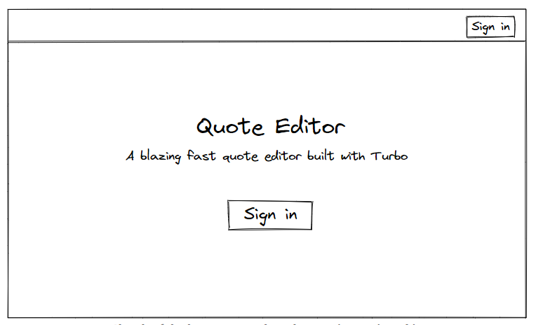
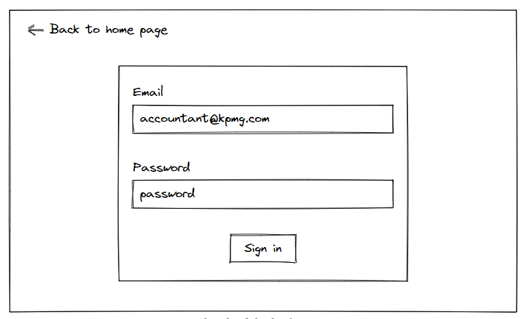
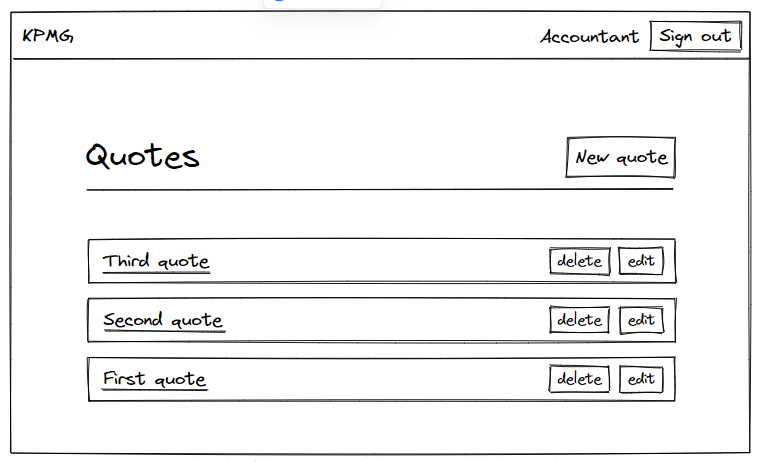

Turbo Streams and security

本章我们将学习如何安全的使用Turbo Stream 和 避免广播数据到非法的用户。

## Understanding Turbo Streams and security

在将Turbo Streams放在线上环境前，我们必须知道如何保证安全，如果把含有私密数据的HTML发送到了不该接收的人那里，这会是一个很大的问题。

让我们想象一下我们的quote编辑器被一个公司使用，公司内有很多的员工，如果有天我们的数据被一个不属于该公司的人获取到了，那这就是个很大安全事故了。

我们将使用[Devise gem](https://github.com/heartcombo/devise)对用户操作，模拟现实生活来对Turbo Stream security进行学习，并且我们将展示如果我们不够足够重视，将会出现哪些安全问题。

## What we will build

我们将画一个草图来说明本章结束时系统的样子，我们将对没有登录的用户展示登录页面链接



然后用户通过输入用户名，密码进行登录



我们的用户在登录后跳转到首页，在导航栏中我们将根据电子邮件地址显示公司名称和用户名称，当点击`View quotes`按钮时，他们便可以操作我们的编辑器


当点击`View quotes`按钮时，用户将被导航到`Quotes#index`页面，并带有一个导航栏



然后我们添加好数据后，我们的系统看起来就可以了，不过我们会在浏览器中找到一个安全问题去做实验。

`Quote,Company,User`的关系如下

- 一个用户属于一个公司
- 一个quote属于一个公司
- 一个公司有多个用户
- 一个公司有多个quote

我们的数据库设计会像下面的草图：


我们会使用`rails db:seed`指令去添加数据，来模拟一个真是的场景，在`fixtures`中，我们需要两个公司和三个用户

- **KPMG**公司有两个用户：an **accountant** and a **manager**
- **PwC**公司只有一个用户：一个绝对不该知道**KPMG公司**数据的偷听者。

让我们创建模型，并加入相关的依赖

## Adding companies to our Rails application

创建公司模型

```sh
rails generate model Company name
```

编辑迁移文件，需要保证公司名不能为空，添加：`null:false`进行数据库限制

```ruby
# db/migrate/XXXXXXXXXXXXXX_create_companies.rb

class CreateCompanies < ActiveRecord::Migration[7.0]
  def change
    create_table :companies do |t|
      t.string :name, null: false

      t.timestamps
    end
  end
end
```

执行迁移文件：

```sh
rails db:migrate
```

操作模型，加入非空验证

```ruby
# app/models/company.rb

class Company < ApplicationRecord
  validates :name, presence: true
end
```

在fixture中的companies.yml中加入上面说的数据

```yml
# test/fixtures/companies.yml

kpmg:
  name: KPMG

pwc:
  name: PwC
```

这里我们仅仅需要两个公司去让我们的实验跑通，所以就不用在`CompaniesController`中编完完整的增删改查代码和对应的试图，让我们来添加对应的用户吧。

## Adding users to our application with Devise

我们将使用[Devise gem](https://github.com/heartcombo/devise)来添加用户，并进行权限校验

先添加`Gemfile`

```
# Gemfile

gem "devise", "~> 4.8.1"
```

下载gem

```sh
bundle install
bin/rails generate devise:install
```

使用Devise生成器生成User模型

```sh
bin/rails generate devise User
bin/rails db:migrate
```

现在我们就有了User模型，我们需要页面去串联我们在介绍中描述的样子，但是这里我们不会写注册业务，这里只是为了学习安全相关内容，所以尽量让事情简单一些。

我们仅需要有用户，并能登录，所以我们将关闭Device的所有特性，除了下面两点：

- 登录
- 校验

下面的我们模型的样子

```ruby
# app/models/user.rb

class User < ApplicationRecord
  devise :database_authenticatable, :validatable
end
```

最后，在创建对应的fixtures文件

```yml
# test/fixtures/users.yml

accountant:
  email: accountant@kpmg.com
  encrypted_password: <%= Devise::Encryptor.digest(User, 'password') %>

manager:
  email: manager@kpmg.com
  encrypted_password: <%= Devise::Encryptor.digest(User, 'password') %>

eavesdropper:
  email: eavesdropper@pwc.com
  encrypted_password: <%= Devise::Encryptor.digest(User, 'password') %>
```

为了安全，Devise存储加密的密码，如果我们希望存储加密后的`password`作为密码，我们需要对应的Devise gem去进行加密，这也是为什么我们使用`Devise::Encryptor.digest`。

现在模型都已经建立好了，接下来我们就对模型建立关联关系。

---

## Users, companies and, quotes associations

目前我们的模型间还没什么关系，我们现在创建对应的移植文件来添加对应的文件

```sh
bin/rails generate migration add_company_reference_to_quotes company:references
bin/rails generate migration add_company_reference_to_users  company:references
```

第一个迁移文件，是对quotes添加`company_id`外键，第二个迁移文件，是对users添加`company_id`。

```sh
bin/rails db:migrate
```

---

**注意：**这里可能会执行失败，因为如果数据库已经有数据了，对应的`company_id`为空，这就与我们模型中设置的非空校验相冲突。

如果我们的项目已经到了线上，则只能先对所有的users和quotes指定`company_id`，然后在设置`null:false`约束，如果我们的项目不在线上，则我们可以简单的删掉数据库，然后从新创建并迁移。

```
bin/rails db:drop db:create db:migrate
```

现在我们迁移就可以完成了

---

现在我们从模型中添加对应的关联关系

```ruby
# app/models/user.rb

class User < ApplicationRecord
  devise :database_authenticatable, :validatable

  belongs_to :company
end
```

```ruby
# app/models/company.rb

class Company < ApplicationRecord
  has_many :users, dependent: :destroy
  has_many :quotes, dependent: :destroy

  validates :name, presence: true
end
```

```ruby
# app/models/quote.rb

class Quote < ApplicationRecord
  belongs_to :company

  # All the previous code
end
```

相应的，我们修改我们的fixtures数据

```yml
# test/fixtures/users.yml

accountant:
  company: kpmg
  email: accountant@kpmg.com
  encrypted_password: <%= Devise::Encryptor.digest(User, 'password') %>

manager:
  company: kpmg
  email: manager@kpmg.com
  encrypted_password: <%= Devise::Encryptor.digest(User, 'password') %>

eavesdropper:
  company: pwc
  email: eavesdropper@pwc.com
  encrypted_password: <%= Devise::Encryptor.digest(User, 'password') %>
```

```yml
# test/fixtures/quotes.yml

first:
  company: kpmg
  name: First quote

second:
  company: kpmg
  name: Second quote

third:
  company: kpmg
  name: Third quote
```

执行：`rails db:seed`来完成数据的加载

## Adding a home page to our application

现在我们已经有了用户，我们得让他们很容易地登陆，就像我们在本章节初画的草图描述一样

1. 用户必须登录后才能看到quote编辑器，并且他只能看到他所属公司的数据
2. 如果用户没有登录，则必须引导用户到首页的登录表单那里

为了解决上面的第一点，我们必须确保用户在系统的每个地方都被权限校验，让我们在`ApplicationController`中设置Devise的`authenticate_user!`方法

```ruby
# app/controllers/application_controller.rb

class ApplicationController < ActionController::Base
  before_action :authenticate_user!
end
```

解决上面的第二点，我们需要未通过权限校验的用户访问到登录表单中，否则他们无法登陆了，让我们给回调添加一个异常。

```ruby
# app/controllers/application_controller.rb

class ApplicationController < ActionController::Base
  before_action :authenticate_user!, unless: :devise_controller?
end
```

我们需要一个首页去引导用户登录，所以现在创建一个`PagesController`，其中home action 作为 root path，这个Controller是公共的，所以可以跳过权限校验。

```ruby
# app/controllers/pages_controller.rb

class PagesController < ApplicationController
  skip_before_action :authenticate_user!

  def home
  end
end
```

添加对应的路由

```ruby
# config/routes.rb

Rails.application.routes.draw do
  root to: "pages#home"

  # All the other routes
end
```

添加对应的响应页面

```ruby
<%# app/views/pages/home.html.erb %>

<main class="container">
  <h1>Quote editor</h1>
  <p>A blazing fast quote editor built with Hotwire</p>

  <% if user_signed_in? %>
    <%= link_to "View quotes", quotes_path, class: "btn btn--dark" %>
  <% else %>
    <%= link_to "Sign in", new_user_session_path, class: "btn btn--dark" %>
  <% end %>
</main>
```

我们不会对这个登陆页面写过多的样式，而是花更多的时间在导航栏，让它在项目的每个页面都展示

让我们先添加导航栏的标签，现在我们会先使用占位符为公司名和当前用户名，但是很快我们就会修改掉，现在我们只需要专注于HTML

```ruby
<%# app/views/layouts/_navbar.html.erb %>

<header class="navbar">
  <% if user_signed_in? %>
    <div class="navbar__brand">
      Company name
    </div>
    <div class="navbar__name">
      Current user name
    </div>
    <%= button_to "Sign out",
                  destroy_user_session_path,
                  method: :delete,
                  class: "btn btn--dark" %>
  <% else %>
    <%= link_to "Sign in",
                new_user_session_path,
                class: "btn btn--dark navbar__right" %>
  <% end %>
</header>
```

为了让每页面都展示导航栏，所以我们可以直接在`application.html.erb`中渲染

```ruby
<%# app/views/layouts/application.html.erb %>

<!DOCTYPE html>
<html>
  <!-- All the <head> content -->

  <body>
    <%= render "layouts/navbar" %>
    <%= yield %>
  </body>
</html>
```

现在每个页面都会展示了，我们来给导航栏写一下样式

```css
// app/assets/stylesheets/components/_navbar.scss

.navbar {
  display: flex;
  align-items: center;
  box-shadow: var(--shadow-large);
  padding: var(--space-xs) var(--space-m);
  margin-bottom: var(--space-xxl);
  background-color: (var(--color-white));

  &__brand {
    font-weight: bold;
    font-size: var(--font-size-xl);
    color: var(--color-text-header);
  }

  &__name {
    font-weight: bold;
    margin-left: auto;
    margin-right: var(--space-s);
    color: var(--color-text-header);
  }

  &__right {
    margin-left: auto;
  }
}
```

记得要导入css到主文件中

```css
// app/assets/stylesheets/application.sass.scss

// All the previous imports
@import "components/navbar";
```

好了，现在除了登录表单样式没设置好，其他内容都与我们的草图大致一样，我们来在浏览器中测试一下吧。（记得执行 ： `rails db:seed`来设置好必要的数据）


