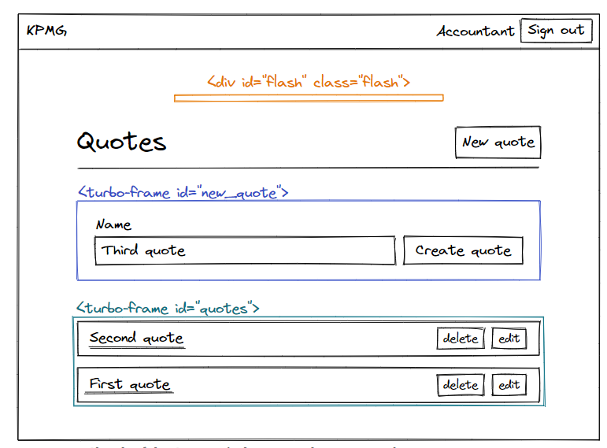
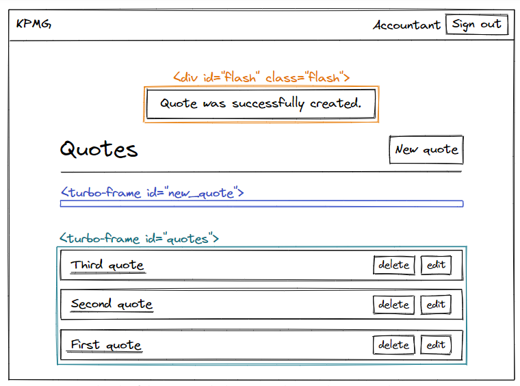

# Flash messages with Hotwire

​	本章节，我们将学习如何添加 flash messages 通过Turbo，并且如何通过Stimulus做出好看的动画效果。

## Adding flash messages to our CRUD controller

现在我们`Quote`模型的增删改查已经正常运转了，现在我们想添加`flash message`去提高系统的可用性。

在使用Turbo增加flash message之前，我们需要先来用不使用Turbo的版本，也就是Rails7之前的方式，而为了做到这一点，我们需要禁用Turbo在整个项目中。

```js
// app/javascript/application.js

import "./controllers"

// The two following lines disable Turbo on the whole application
import { Turbo } from "@hotwired/turbo-rails"
Turbo.session.drive = false
```

这样我们就禁用了Turbo，你可以在浏览器中测试一下，看一下这次是不是就变成跳转页面了。

其实我们在第一章时就使用了flash messages当`#create #update #destory`成功时，通过`notice`选项

```ruby
class QuotesController < ApplicationController
  # All the previous code

  def create
    @quote = current_company.quotes.build(quote_params)

    if @quote.save
      respond_to do |format|
        format.html { redirect_to quotes_path, notice: "Quote was successfully created." }
        format.turbo_stream
      end
    else
      render :new, status: :unprocessable_entity
    end
  end

  # All the previous code

  def update
    if @quote.update(quote_params)
      redirect_to quotes_path, notice: "Quote was successfully updated."
    else
      render :edit, status: :unprocessable_entity
    end
  end

  # All the previous code

  def destroy
    @quote.destroy

    respond_to do |format|
      format.html { redirect_to quotes_path, notice: "Quote was successfully destroyed." }
      format.turbo_stream
    end
  end
end
```

---

**注意**：如果你不熟悉`notice`标记去使用flash messages，那么下面两行语法是一致的

```ruby
# Syntax 1
redirect_to quotes_path, notice: "Quote was successfully created."

# Syntax 2
flash[:notice] = "Quote was successfully created."
redirect_to quotes_path
```

---

我们会先展示不使用Turbo的flash messages，并抽离出一个局部页面partial

```ruby
<%# app/views/layouts/_flash.html.erb %>

<% flash.each do |flash_type, message| %>
  <div class="flash__message">
    <%= message %>
  </div>
<% end %>
```

我们将在每个页面中都渲染这个包含flash message的局部页面。

```ruby
<!DOCTYPE html>
<html>
  <head>
    <!-- All the head code -->
  </head>

  <body>
    <%= render "layouts/navbar" %>

    <div class="flash">
      <%= render "layouts/flash" %>
    </div>

    <%= yield %>
  </body>
</html>
```

现在我们可以在浏览器中试试效果，增，删，改 都可以正常显示，我们再加一点儿css让它看起来更好看

```css
// app/assets/stylesheets/components/_flash.scss

.flash {
  position:fixed;
  top: 5rem;
  left: 50%;
  transform: translateX(-50%);

  display: flex;
  flex-direction: column;
  align-items: center;
  gap: var(--space-s);

  max-width: 100%;
  width: max-content;
  padding: 0 var(--space-m);

  &__message {
    font-size: var(--font-size-s);
    color: var(--color-white);
    padding: var(--space-xs) var(--space-m);
    background-color: var(--color-dark);
    animation: appear-then-fade 4s both;
    border-radius: 999px;
  }
}
```

这里的`.flash CSS class`是我们flash messages的容器，它在屏幕上是固定位置，每个独立的flash message都被`.flash_message CSS class`装饰，我们将使用`apper-then-fade`,一个自定义动画来展示flash messages。

```css
// app/assets/stylesheets/config/_animations.scss

@keyframes appear-then-fade {
  0%, 100% {
    opacity:0
  }
  5%, 60% {
    opacity:1
  }
}
```

这两个文件添加后，我们把它们加入到样式清单中。

```css
// app/assets/stylesheets/application.sass.scss

@import "components/flash";
@import "config/animations";
```

我们在浏览器中看看效果吧，在登陆和注册时都会弹出对应的flash信息

---

这里我在测试增删改时，发现并没有弹出flash message信息，看一下下面有没有解决方案

---

当前系统有个小问题，当将鼠标移动到flash message区域，我们的鼠标样式即使在flash message消失时，也还是没有变，这是因为虽然我们的flash message可见度为9，但它依然存在于DOM上，并在页面数据上面，为了解决这个问题，我们需要当消失时从DOM中删除flash messages。

这就是我们整个教程中需要加入的JS代码，我们将创建一个[Stimulus Controller](https://stimulus.hotwired.dev/handbook/introduction)来删除flash message，当`appear-then-fade`动画效果消失时。

执行下面的指令，来创建一个叫做`removals`的Stimulates Controller

```sh
bin/rails generate stimulus removals
```

执行后将会把新建的Stimulate Controller自动导入到`app/javascript/controllers/index.js`文件中

```js
// app/javascript/controllers/index.js

import { application } from "./application"

import HelloController from "./hello_controller.js"
application.register("hello", HelloController)

import RemovalsController from "./removals_controller.js"
application.register("removals", RemovalsController)
```

可以看到，这里有一个`HelloController`,是在我们创建项目时自动生成的，我们不再需要它了，删除掉

```sh
bin/rails destroy stimulus hello
```

这个指令就会删除掉`HelloController`,并且更新index.js文件

```js
// app/javascript/controllers/index.js

import { application } from "./application"

import RemovalsController from "./removals_controller.js"
application.register("removals", RemovalsController)
```

---

**注意:**如果你执行`bin/rails destroy stimulus hello`时，并没有更新掉HelloController的信息，这可能是Rails的小bug，你可以直接手动删除或者执行：`bin/rails stimulus:manifest:update`指令。

---

现在我们来实现我们的Stimulates Controller

```js
// app/javascript/controllers/removals_controller.js

import { Controller } from "@hotwired/stimulus"

export default class extends Controller {
  remove() {
    this.element.remove()
  }
}
```

这个controller有一个叫`remove`的简洁函数，当我们调用该方法时，指定这个controller的DOM节点就会被删除。

如果觉得有点儿抽象，我们就在我们的flash messages中使用controller，当动画消失时，删除DOM节点。并解释到底是怎么运转的。

```ruby
<%# app/views/layouts/_flash.html.erb %>

<% flash.each do |flash_type, message| %>
  <div
    class="flash__message"
    data-controller="removals"
    data-action="animationend->removals#remove"
  >
    <%= message %>
  </div>
<% end %>
```

**由于data attribute的命名约定，Stimulus库允许我们将在Stimulus Controller中定义的JavaScript行为链接到HTML。**

上面的HTML片段会指定每个flash message连通到RemovalsController，这是因为我们指定了：`data-controller="removals`,当动画结束时，`RemovalsController`中的`remove`函数就会被调用，因为我们指定了：`data-action="animationend->removals#remove`。

如果我们在浏览器中测试一下，就能发现，当动画消失时，flash message的DOM真的被移除了。

下面我们将Turbo从新打开，来展示Flash message

## Flash messages with Turbo in Rails 7

首先把禁用Turbo的代码去掉

```js
// app/javascript/application.js

import "./controllers"
import "@hotwired/turbo-rails"
```

我们会发现，又变成了单页面，但尽管我们使用了`notice:`，我的flash message却不见了。

```ruby
# app/controllers/quotes_controller.rb

def create
  @quote = current_company.quotes.build(quote_params)

  if @quote.save
    respond_to do |format|
      format.html { redirect_to quotes_path, notice: "Quote was successfully created." }
      format.turbo_stream
    end
  else
    render :new
  end
end
```

让我们给Turbo Stream format添加相同的flash message数据

```ruby
# app/controllers/quotes_controller.rb

def create
  @quote = current_company.quotes.build(quote_params)

  if @quote.save
    respond_to do |format|
      format.html { redirect_to quotes_path, notice: "Quote was successfully created." }
      format.turbo_stream { flash.now[:notice] = "Quote was successfully created." }
    end
  else
    render :new
  end
end
```

我们使用了`flash.now[:notice]`而不是`flash[:notice]`是因为Turbo Stream的响应不会重定向到其他地方，页面不会刷新，所以flash信息必须在当前页面出现。

如果你在浏览器中测试一下，flash message仍然无法显示在页面，这是因为我们指定当quote成功创建后渲染的页面如果去处理flash message。

```ruby
<%# app/views/quotes/create.turbo_stream.erb %>

<%= turbo_stream.prepend "quotes", @quote %>
<%= turbo_stream.update Quote.new, "" %>
```

为了让flash message与Turbo Stream responses合作，我们需要添加一行去指定Turbo将flash message添加到列表前面，或者更新flash message容器中的内容。

我们使用的Turbo Stream动作取决于我们想要的效果。如果我们要堆叠Flash消息，并有一个单页的应用效果，我们可以使用prepend。如果我们要有一个单一的闪烁消息在屏幕上的时候，我们可以使用替换。

本次教程中使用 prepend

```ruby
<%# app/views/quotes/create.turbo_stream.erb %>

<%= turbo_stream.prepend "quotes", @quote %>
<%= turbo_stream.update Quote.new, "" %>
<%= turbo_stream.prepend "flash", partial: "layouts/flash" %>
```

最后一行代码指定Turbo去prepend到id为flash的DOM前面，插入`layouts/flash`局部信息，我们当前并没有一个id为flash的DOM，所以我们加上这部分

```html
<!DOCTYPE html>
<html>
  <head>
    <!-- All the head code -->
  </head>

  <body>
    <%= render "layouts/navbar" %>

    <div id="flash" class="flash">
      <%= render "layouts/flash" %>
    </div>

    <%= yield %>
  </body>
</html>
```

让我们在浏览器中测试一下，当创建两个quotes后，我们可以看到两个flash message出现在屏幕中，并在动画结束后消失。

让我们画一些草图，来说明当我们创建一条记录时，发生了什么，当我们创建数据时：



当我们提交表单时，这条数据被创建，并且渲染`create.turbo_stream.erb`页面，而这个页面会控制Turbo完成下面的操作

- 把新加的数据添加到id为`quotes`的DOM前面
- 清空id为`new_quote`的DOM内容
- 把flash message的信息放到id为`flash`的DOM前面

当这三个行为被执行时，我们的最终页面会变成下面的样子：



现在我们的flash message可以与`QuotesController#create`一起工作了，所以我们再在`QuotesController#update and QuotesController#destory`中添加flash messages，在阅读下面的两部分前，我们可以放轻松了。

## Flash messages with Hotwire on the `#update` action

与`#create action`不同，`#update action`并没有为Turbo Stream responses指定具体的视图，如果我们在浏览器中测试，flash message并不会在页面中出现。

如果我们在第四章讨论的，quote编辑表单是嵌入在Turbo Frame中的，而Turbo Frame是独立于页面其他部分的，当我们修改数据时，即使响应信息中包含flash message，**Turbo也只会摘取和替换响应体中被修改数据的信息。**

如果我们想对`#update action`添加flash message，我们就必须像`#create action`一样，创建对应的Turbo Stream view。而我们要做的第一件儿事儿就是修改`#update method`在controller中。

```ruby
def update
  if @quote.update(quote_params)
    respond_to do |format|
      format.html { redirect_to quotes_path, notice: "Quote was successfully updated." }
      format.turbo_stream { flash.now[:notice] = "Quote was successfully updated." }
    end
  else
    render :edit, status: :unprocessable_entity
  end
end
```

我们指定update支持Turbo Stream format，我们也需要指定Turbo Stream view

```ruby
<%# app/views/quotes/update.turbo_stream.erb %>

<%= turbo_stream.replace @quote %>
<%= turbo_stream.prepend "flash", partial: "layouts/flash" %>
```

现在再在浏览器中测试一下，如我们所见，当数据更新时，flash message也被渲染出了。

## Flash messages with Hotwire on the `#destroy` action

和 创建，修改一样，我们先让`#destory`支持Turbo Stream format，并指定返回的flash message

```ruby
def destroy
  @quote.destroy

  respond_to do |format|
    format.html { redirect_to quotes_path, notice: "Quote was successfully destroyed." }
    format.turbo_stream { flash.now[:notice] = "Quote was successfully destroyed." }
  end
end
```

再写对应的Turbo Stream view

```ruby
<%# app/views/quotes/destroy.turbo_stream.erb %>

<%= turbo_stream.remove @quote %>
<%= turbo_stream.prepend "flash", partial: "layouts/flash" %>
```

在浏览器中看看吧

## Refactoring our flash messages with a helper

在我们刚刚创建的三个Turbo Stream view，我们在渲染flash message时，使用了相同的代码。

```ruby
<%= turbo_stream.prepend "flash", partial: "layouts/flash" %>
```

这里有几个理由去进行修改，例如：我们想用 update 替换 prepend，或者修改 `layouts/flash` 为 `components/flash`，那我们每个页面都需要修改啊。

为了让这些修改更方便，一个策略就是删除重复的代码，DRY原则(Don't Repeat Yourself)，抽离出来，这样未来只需要在一个地方去修改。

以我们的项目为例，我们将会创建helper来去除冗余，我们将定义函数在`ApplicationHelper`

```ruby
# app/helpers/application_helper.rb

module ApplicationHelper
  def render_turbo_stream_flash_messages
    turbo_stream.prepend "flash", partial: "layouts/flash"
  end
end
```

然后再在每个Turbo Stream views中使用helper

```ruby
<%# app/views/quotes/create.turbo_stream.erb %>

<%= turbo_stream.prepend "quotes", @quote %>
<%= turbo_stream.update Quote.new, "" %>
<%= render_turbo_stream_flash_messages %>
```

```ruby
<%# app/views/quotes/update.turbo_stream.erb %>

<%= turbo_stream.replace @quote %>
<%= render_turbo_stream_flash_messages %>
```

```ruby
<%# app/views/quotes/destroy.turbo_stream.erb %>

<%= turbo_stream.remove @quote %>
<%= render_turbo_stream_flash_messages %>
```

通过使用helper，我们可以安全的修改flash信息如何在整个页面中展示，我们的代码变的更整洁。

## Wrap up

Flash messages是一个很重要的工具，可以提供使用者重要信息。

在Rails7使用Flash message时，我们需要一些调整，相比之前的版本。

并且现在我们能做的更多，例如：当在短时间内发生多个操作时，可以堆叠闪存消息！

在下一章中，我们将学习到另一个重要工具，来提升用户体验。**Empty status!**
