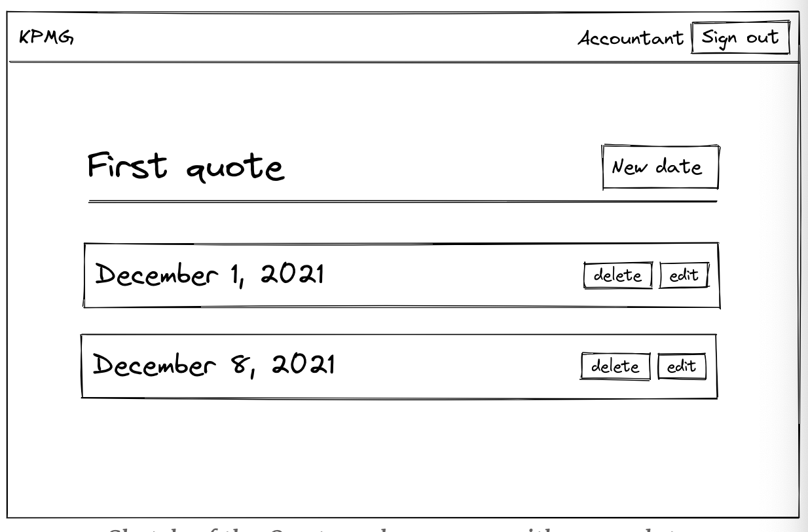
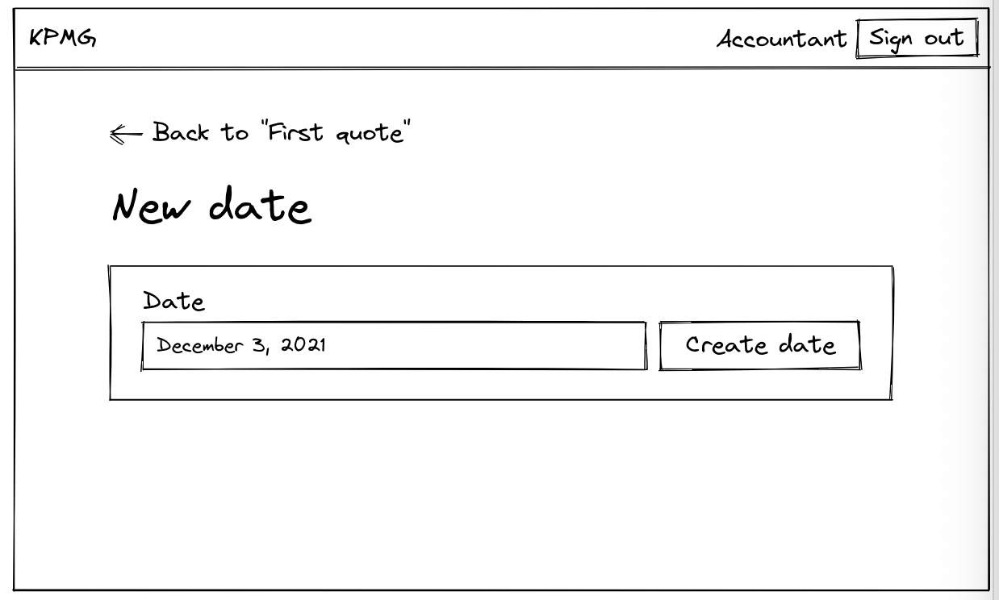
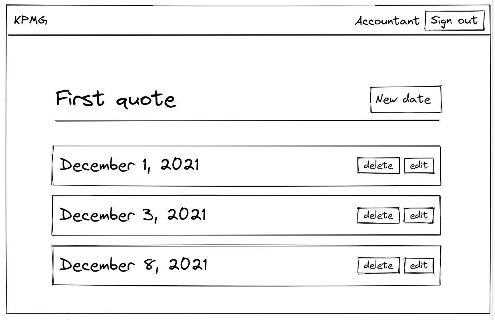
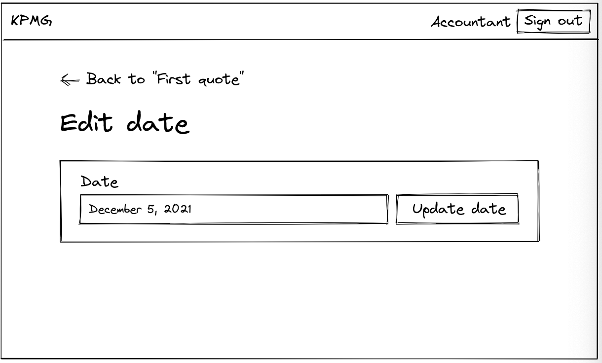
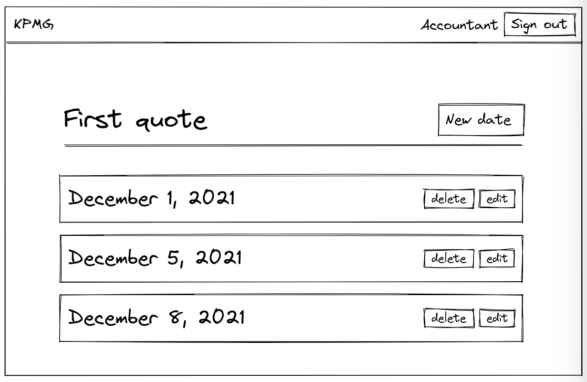
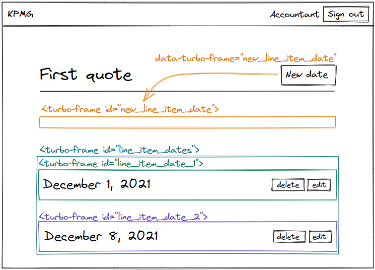
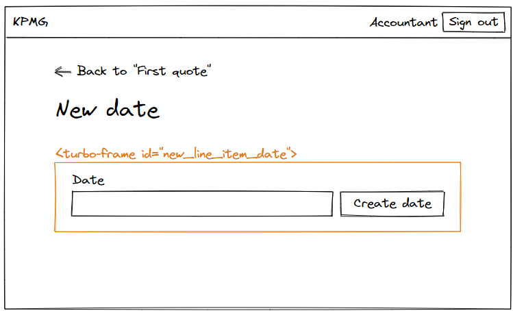
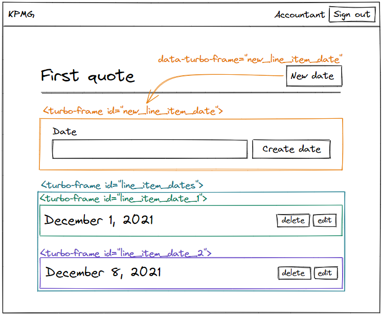
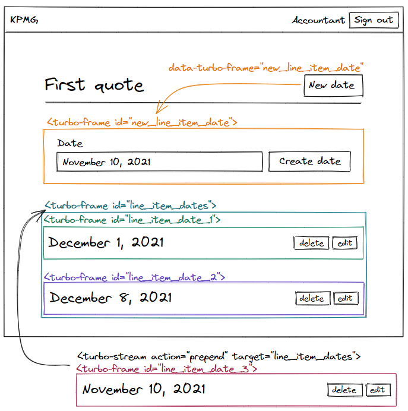

# Another CRUD controller with Turbo Rails

本章节中，我们将构建quotes中的日期数据的增删改查，这是一个很好的机会去练习我们之前学习的内容。

## 下面三章构建内容

现在用户可以创建，修改，删除quotes数据，是时候让我们的quotes编辑器做一些更有用的事儿。

接下来三章，我们将在`Quotes#show`页面中构建，当本章结束时，我们的用户可以为每个quotes添加多个日期，而每个日期里有多个条目，每个条目拥有名称，可选的描述信息，数量，单价。

在动手之前，我们可以再在线上实例中体验一下：[quote editor on hotrails.dev](https://www.hotrails.dev/quotes)，创建一个quote，进入`Quotes#show`页面，我们可以创建多个日期，并在日期里添加多个条目，当我们创建，修改，删除条目时，quote的总额也会被更新。

## 本章构建内容

我们还是在不使用Turbo Frames和Turbo Streams的前提下构建日期数据的增删改查，因为我们需要我们的控制器在进行任何改进之前能正常工作

让我们画一个草图，当我们访问`Quotes#show`也页面时,我们应该能看到该条quote的日期数据



当我们不使用`Turbo`构建增删改查前，点击`New date`链接时，会带我们到`LineItemDates#new`页面



当我们提交一个可用数据时，就被重定向到`Quotes#show`页面，展示新建的数据，而日期数据应该是正序排序好的



如果我们决定修改刚刚创建的数据时，我们可以点击`Edit`链接，跳转到`LineItemDates#edit`页面



如果我们提交的是可用数据，则又被重定向到`Quotes#show`页面中，其中被修改的数据在页面中也更新了。并且数据仍然保证排序



最后当我们想删除数据时，点击`Delete`链接，数据也就从列表中移除了。

现在需求被明确了，来敲代码吧。

## 创建模型

让我们创建`LineItemDate`模型，拥有日期字段，并包含所属的quote_id字段，每个line item属于一条quote，而一个quote可以拥有多个line item。

```shell
bin/rails generate model LineItemDate quote:references date:date
```

在执行`rails db:migrate`指令前，我们必须给迁移文件添加一些约定

- 每条`LineItemDate`的日期字段必须非空，我们会在模型中加入一些校验。
- 我们希望同一时间一个quote中应该只有一个时间数据，我在数据库层面去控制它，所以会对`quote_id and date`加入唯一索引
- 由于我们会对line item进行排序，为了性能优化，我们也会加上索引。

最终的迁移文件会是这样的：

```ruby
# db/migrate/XXXXXXXXXXXXXX_create_line_item_dates.rb

class CreateLineItemDates < ActiveRecord::Migration[7.0]
  def change
    create_table :line_item_dates do |t|
      t.references :quote, null: false, foreign_key: true
      # Adding null: false constraint on date
      t.date :date, null: false

      t.timestamps
    end

    # Adding uniqueness constraint for the couple date and quote_id
    add_index :line_item_dates, [:date, :quote_id], unique: true
    # Adding index to the date field for performance reasons
    add_index :line_item_dates, :date
  end
end
```

执行迁移命令：

```sh
bin/rails db:migrate
```

添加关联关系到`LineItemDate`模型中，和排序

```ruby
# app/models/line_item_date.rb

class LineItemDate < ApplicationRecord
  belongs_to :quote

  validates :date, presence: true, uniqueness: { scope: :quote_id }

  scope :ordered, -> { order(date: :asc) }
end
```

- 每一天line item date 都是非空的，使用`presence:true"`
- 一个quote不会有相同的两个date，使用`uniqueness: {scope: :quote_id}`

再到`Quote`模型中加入关联关系

```ruby
# app/models/quote.rb

class Quote < ApplicationRecord
  has_many :line_item_dates, dependent: :destroy

  # All the previous code...
end
```

我们模型层面就完成了，下面我们再完善路由

## Adding routes for line item dates

我们想要执行`LineItemDate`模型中增删改查中的七个actions，除了下面的两个：

- 我们不需要`LineItemDates#index`action，因为所有的数据已经在`Quotes#show`页面中展示了
- 我们也不需要`LineItemDates#show`action，因为展示单条line item date没啥意义。我们需要看quote中所有的数据

```ruby
# config/routes.rb

Rails.application.routes.draw do
  # All the previous routes

  resources :quotes do
    resources :line_item_dates, except: [:index, :show]
  end
end
```

我们使用restful resources，看起来很简洁。下一部分，我们会添加一些假的数据给fixtures。

## Designing line item dates

`Quotes#show`页面现在是空的，当我们添加点儿假数据

```yaml
# test/fixtures/line_item_dates.yml

today:
  quote: first
  date: <%= Date.current %>

next_week:
  quote: first
  date: <%= Date.current + 1.week %>
```

执行`bin/rails db:seed`指令后，数据就添加到了数据库，现在打开系统中第一条quote的`Quotes#show`页面，现在的页面是这样的：

```ruby
<%# app/views/quotes/show.html.erb %>

<main class="container">
  <%= link_to sanitize("&larr; Back to quotes"), quotes_path %>
  <div class="header">
    <h1>
      <%= @quote.name %>
    </h1>
  </div>
</main>
```

为了匹配我们的草图， 我们需要一个跳转到`LineItemDates#new`页面的链接，并且需要渲染line item dates集合。

```ruby
<%# app/views/quotes/show.html.erb %>

<main class="container">
  <%= link_to sanitize("&larr; Back to quotes"), quotes_path %>

  <div class="header">
    <h1>
      <%= @quote.name %>
    </h1>

    <%= link_to "New date",
                new_quote_line_item_date_path(@quote),
                class: "btn btn--primary" %>
  </div>

  <%= render @line_item_dates, quote: @quote %>
</main>
```

去渲染line item dates集合，我们首先应该返回所有的line items在`QuotesController#show`action中

```ruby
# app/controllers/quotes_controller.rb

class QuotesController < ApplicationController
  # All the previous code...

  def show
    @line_item_dates = @quote.line_item_dates.ordered
  end

  # All the previous code...
end
```

接下来我们为单个line item date创建html

```html
<%# app/views/line_item_dates/_line_item_date.html.erb %>

<div class="line-item-date">
  <div class="line-item-date__header">
    <h2 class="line-item-date__title">
      <%= l(line_item_date.date, format: :long) %>
    </h2>

    <div class="line-item-date__actions">
      <%= button_to "Delete",
                    [quote, line_item_date],
                    method: :delete,
                    class: "btn btn--light" %>
      <%= link_to "Edit",
                  [:edit, quote, line_item_date],
                  class: "btn btn--light" %>
    </div>
  </div>
</div>
```

大多数的标签都被嵌套到class为的`.line-item-date_header`的div标签中，这是因为我们会在下一章中写`.line-item-date_body`和`.line-item-date_footer`类，其中将会包含quote中的所有line items和新建line item的链接。为了减少这里要写的CSS/HTML数量，我们之后再处理这里。

---

**注意：**我为了更好的可读性，这里使用了不同的路由形式，本教程中我想要让代码更短小一些，如果你还不太熟悉多样的路由形式，下面的两行代码是相同的（但第二种明显更长）

```ruby
<%= button_to "Delete", [quote, line_item_date] %>
<%= button_to "Delete", quote_line_item_date_path(quote, line_item_date) %>
```

在Controllers中也可以这么使用，比如下面的代码就是等价的

```ruby
redirect_to @quote
redirect_to quote_path(@quote)
```

如果你想了解更多内容，看看文档：[the documentation](https://api.rubyonrails.org/classes/ActionDispatch/Routing/PolymorphicRoutes.html)

----

现在我们已经定义了HTML标签，让我们添加点儿样式吧

```css
// app/assets/stylesheets/components/_line_item_date.scss

.line-item-date {
  margin-top: var(--space-xl);
  margin-bottom: var(--space-xxs);

  &__header {
    display: flex;
    align-items: center;
    justify-content: space-between;
    gap: var(--space-xs);
  }

  &__title {
    font-size: var(--font-size-xl);

    @include media(tabletAndUp) {
      font-size: var(--font-size-xxl);
    }
  }

  &__actions {
    display: flex;
    gap: var(--space-xs);
  }
}
```

不要忘了引入新的css文件到manifest中

```css
// app/assets/stylesheets/application.sass.scss

// All the previous code
@import "components/line_item_date";
```

一切正常工作，可以在浏览器中测试一下，现在我们开始写Controller

## Our standard CRUD controller

### Creating line item dates without Turbo

现在我们的数据库，模型，路由，样式都完成了，是时候开始写Controller了，如上面的介绍，我们先构建一个不使用**Turbo Frames and Turb Streams**的标准增删改查，我们将在后面再优化。

我们先写`#new and #create`actions

```ruby
# app/controllers/line_item_dates_controller.rb

class LineItemDatesController < ApplicationController
  before_action :set_quote

  def new
    @line_item_date = @quote.line_item_dates.build
  end

  def create
    @line_item_date = @quote.line_item_dates.build(line_item_date_params)

    if @line_item_date.save
      redirect_to quote_path(@quote), notice: "Date was successfully created."
    else
      render :new, status: :unprocessable_entity
    end
  end

  private

  def line_item_date_params
    params.require(:line_item_date).permit(:date)
  end

  def set_quote
    @quote = current_company.quotes.find(params[:quote_id])
  end
end
```

再加上对应的视图模版

```ruby
<%# app/views/line_item_dates/new.html.erb %>

<main class="container">
  <%= link_to sanitize("&larr; Back to quote"), quote_path(@quote) %>

  <div class="header">
    <h1>New date</h1>
  </div>

  <%= render "form", quote: @quote, line_item_date: @line_item_date %>
</main>
```

`LineItemDates#new`页面不需要特别的设计，因为稍后我们将使用Turbo从页面中提取表单并将其插入`Quotes#show`页面。但是，对于使用不支持Turbo的旧浏览器的用户来说，它仍然是可用的。让我们为我们的表单添加标记:

```ruby
<%# app/views/line_item_dates/_form.html.erb %>

<%= simple_form_for [quote, line_item_date], html: { class: "form line-item-date" } do |f| %>
  <% if line_item_date.errors.any? %>
    <div class="error-message">
      <%= line_item_date.errors.full_messages.to_sentence.capitalize %>
    </div>
  <% end %>

  <%= f.input :date, html5: true, input_html: { autofocus: true } %>
  <%= link_to "Cancel", quote_path(quote), class: "btn btn--light" %>
  <%= f.submit class: "btn btn--secondary" %>
<% end %>
```

现在我们再在浏览器中测试一下吧

## Refactoring the error notification message

这是一个好机会去重构表单中提示的异常信息，我们可能已经注意到了不论在quote表单还是line item date表单中使用了相同方式去展示异常数据。

```ruby
<%# app/views/quotes/_form.html.erb %>

<% if quote.errors.any? %>
  <div class="error-message">
    <%= quote.errors.full_messages.to_sentence.capitalize %>
  </div>
<% end %>
```

```ruby
<%# app/views/line_item_dates/_form.html.erb %>

<% if line_item_date.errors.any? %>
  <div class="error-message">
    <%= line_item_date.errors.full_messages.to_sentence.capitalize %>
  </div>
<% end %>
```

我们想让整个项目一致的展示异常信息，让我们创建helper方法来保证每个表单都使用同样的方式处理

```ruby
# app/helpers/application_helper.rb

module ApplicationHelper
  # All the previous code

  def form_error_notification(object)
    if object.errors.any?
      tag.div class: "error-message" do
        object.errors.full_messages.to_sentence.capitalize
      end
    end
  end
end
```

现在，我们的项目有了两个helper方法，现在可以这么做，但当我们的项目越变越大，把这些helper交给逻辑独立的单元管理就很重要了，比如使用`FormHelper`处理表单相关的代码。不过现在我们不需要着重考虑，我们仅仅消除重复：

```ruby
<%# app/views/line_item_dates/_form.html.erb %>

<%# All the previous code %>
<%= form_error_notification(line_item_date) %>
<%# All the previous code %>
```

```ruby
<%# app/views/quotes/_form.html.erb %>

<%# All the previous code %>
<%= form_error_notification(quote) %>
<%# All the previous code %>
```

通过这个helper，最终line item date表单就是下面的样子：

```ruby
<%# app/views/line_item_dates/_form.html.erb %>

<%= simple_form_for [quote, line_item_date], html: { class: "form line-item-date" } do |f| %>
  <%= form_error_notification(line_item_date) %>

  <%= f.input :date, html5: true, input_html: { autofocus: true } %>
  <%= link_to "Cancel", quote_path(quote), class: "btn btn--light" %>
  <%= f.submit class: "btn btn--secondary" %>
<% end %>
```

记得在浏览器中再测试一下呐

让我们花几秒钟的时间用标签和提交按钮所需的文本填充翻译文件:

```yml
# config/locales/simple_form.en.yml

en:
  simple_form:
    placeholders:
      quote:
        name: Name of your quote
    labels:
      quote:
        name: Name
      line_item_date:
        date: Date

  helpers:
    submit:
      quote:
        create: Create quote
        update: Update quote
      line_item_date:
        create: Create date
        update: Update date
```

这样当创建`LineItemDate`时就展示：`Create date`,在修改时展示：`Update date`

## Updating line item dates without Turbo

现在`#new and #create`action正常工作了，让我们接着写`#edit and #update`action，我们从Controller开始

```ruby
class LineItemDatesController < ApplicationController
  before_action :set_quote
  before_action :set_line_item_date, only: [:edit, :update, :destroy]

  # All the previous code

  def edit
  end

  def update
    if @line_item_date.update(line_item_date_params)
      redirect_to quote_path(@quote), notice: "Date was successfully updated."
    else
      render :edit, status: :unprocessable_entity
    end
  end

  private

  def set_line_item_date
    @line_item_date = @quote.line_item_dates.find(params[:id])
  end

  # All the previous code
end
```

我们知道 `#destory`action 也需要`set_line_item_date`回调，所以提前加上去了，针对需要这个回调的操作。

现在action已经实现了，让我们添加`LineItemDates#edit`页面，并在浏览器中测试

```ruby
<%# app/views/line_item_dates/edit.html.erb %>

<main class="container">
  <%= link_to sanitize("&larr; Back to quote"), quote_path(@quote) %>

  <div class="header">
    <h1>Edit date</h1>
  </div>

  <%= render "form", quote: @quote, line_item_date: @line_item_date %>
</main>
```

可以看到：`LineItemDates#edit`view 和 `LineItemDates#new`view 十分相似，只有标题不一样，现在我们在浏览器中测试一下，只剩下一个操作要完成了！

## Deleting line item dates without Turbo

这个操作是最简单的，也没有视图，我们只需要在删除后，重定向到`Quotes#show`页面

```ruby
class LineItemDatesController < ApplicationController
  # All the previous code

  def destroy
    @line_item_date.destroy

    redirect_to quote_path(@quote), notice: "Date was successfully destroyed."
  end

  # All the previous code
end
```

一切运转正常，为了防止用户以外删除数据，我们加入提示语

```ruby
<%# app/views/line_item_dates/_line_item_date.html.erb %>

<!-- All the previous code -->

<%= button_to "Delete",
              quote_line_item_date_path(quote, line_item_date),
              method: :delete,
              form: { data: { turbo_confirm: "Are you sure?" } },
              class: "btn btn--light" %>

<!-- All the previous code -->
```

`button_to helper` 生成了HTML中的表单部分，如果我们从DOM中查看，就是下面的样子：

```html
<form data-turbo-confirm="Are you sure?" class="button_to" method="post" action="/quotes/123/line_item_dates/456">
  <input type="hidden" name="_method" value="delete" autocomplete="off">
  <button class="btn btn--light" type="submit">Delete</button>
  <input type="hidden" name="authenticity_token" value="long_token" autocomplete="off">
</form>
```

需要注意的是`data-turbo-confirm`数据是在`<form> 标签中`，但我们删除时，确认信息显示在屏幕上。

现在增删改查就完成了，但我们想要所有的交互都在同一页面中，通过Turbo，我们仅需要几行代码就可以完成优化。

## Adding Turbo Frames and Turbo Streams

现在我们让所有的交互操作放到`Quotes#show`页面，这和我们之前在`Quotes#index`页面的操作类似

### Creating line item dates with Turbo

为了理清需求，让我们画一个草图说明，当用户访问`Quotes#show`页面，并且点击`New date`按钮，表单直接渲染到`Quotes#show`页面，这里就需要Turbo Frames了，当然我们也就需要`data-turbo-frame`去将`New date`链接嵌套到一个空的Turbo Frame



为了能进行替换，需要使用相同的id，根据约定，这个id是new_line_item_date，因为它是LineItemDate模型的一个新实例。



当用户点击`New date`按钮时，Turbo就能成功替换`Quotes#show`页面中的空Turbo Frame，使用`LineItemDates#new`页面中Turbo Frame包含的表单。



当用户提交表单后，如果该条quote已经有数据了，我们想要新建的line item被插入到`Quotes#show`页面中正确的位置上，并按照升序展示。


另一方面，如果该条quote之前没有一条数据，那刚刚新建的数据对应的HTML应该被插入到列表的开始位置。



现在需求已经理清楚了，通过Turbo Frames and Turbo Streams，我们能仅用几行代码就能实现目标。

先来完成第一部分：用户点击`New date`按钮时，表单出现在`Quotes#show`页面，这和`Quotes#index`页面是类似的。在`Quotes#show`页面中，让我们添加一个id为`new_line_itme_date`的空Turbo Frame，并且链接到`New date`按钮上

```ruby
<%# app/views/quotes/show.html.erb %>

<main class="container">
  <%= link_to sanitize("&larr; Back to quotes"), quotes_path %>

  <div class="header">
    <h1>
      <%= @quote.name %>
    </h1>

    <%= link_to "New date",
                new_quote_line_item_date_path(@quote),
                data: { turbo_frame: dom_id(LineItemDate.new) },
                class: "btn btn--primary" %>
  </div>

  <%= turbo_frame_tag LineItemDate.new %>
  <%= render @line_item_dates, quote: @quote %>
</main>
```

现在使用相同的Turbo Frame id的标签嵌套我们的表单

```ruby
<%# app/views/line_item_dates/new.html.erb %>

<main class="container">
  <%= link_to sanitize("&larr; Back to quote"), quote_path(@quote) %>

  <div class="header">
    <h1>New date</h1>
  </div>

  <%= turbo_frame_tag @line_item_date do %>
    <%= render "form", quote: @quote, line_item_date: @line_item_date %>
  <% end %>
</main>
```

现在当点击新建按钮时，表单就出现在`Quotes#show`页面了

