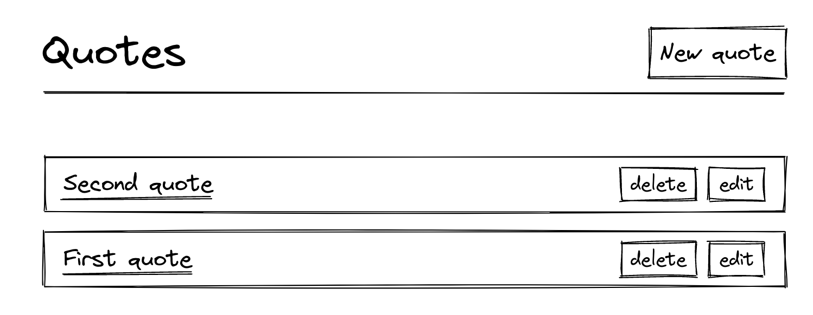
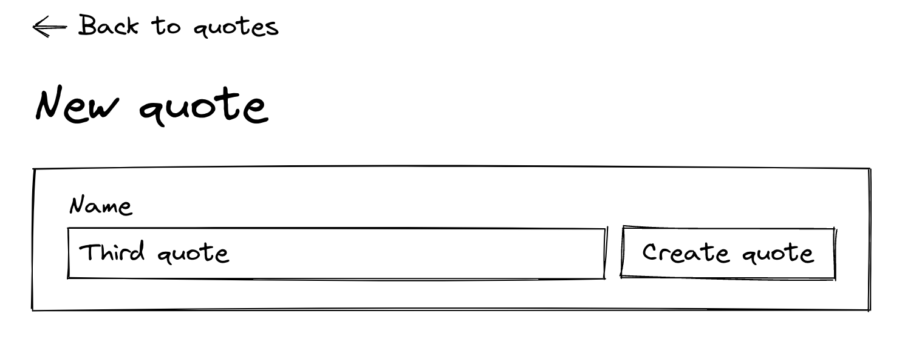
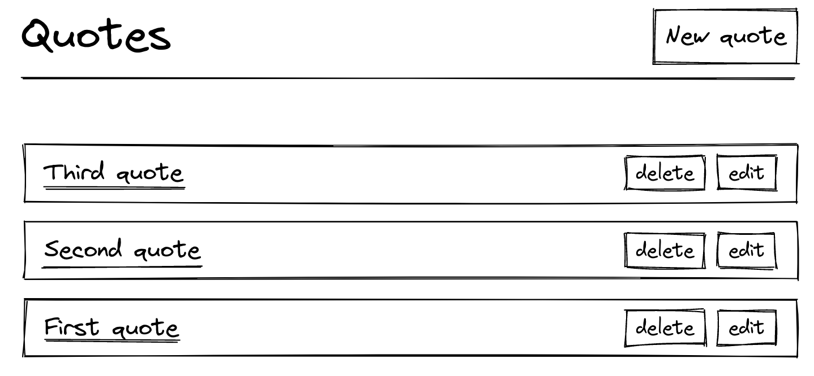
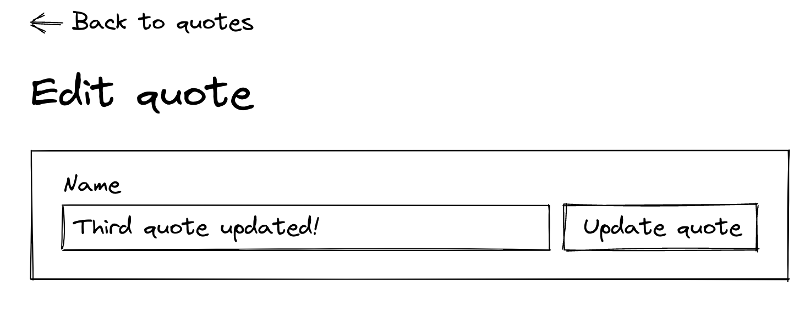
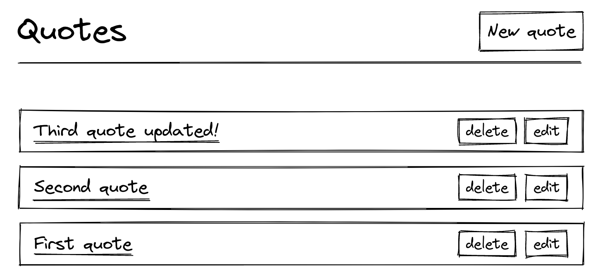

## 实现简单的增删改查

> 这一章，我们将要创建quote模型，并关联Controller通过Rails的约定

我们先通过[Excalidraw](https://excalidraw.com/)来画一些草图，来描述我们要做的事儿

在`Quotes#index`页面中，我们将展示quotes集合，并且每个quote都有详情，修改，删除的按钮，并且也有增加的按钮。下面是样式图：



当点击`New quote`按钮时跳转到`Quotes#new`页面：



当点击`Create quote`时又跳转到`Quotes#index`页面，显示存储的数据，并按照时间排序。



当你点击Edit按钮时，就会跳转到`Quotes#edit`去更新已有的数据



当点击`Update quote`，还是跳回`Quotes#index`页面



当点击quote的标题时，则跳转到`Quotes#show`，现在我们仅仅显示标题，后面增加其他内容。


在开始之前，我们先创建一些测试用例去确保我们构建的内容正常

### 测试

> 测试是软件开发的基础部分，如果没有一个强有力的测试，我们将会引入bug，并无意间影响以往的功能。

- 创建测试文件

```shell
bin/rails g system_test quotes
```

- 编写测试用例

```ruby
# test/system/quotes_test.rb
require "application_system_test_case"

class QuotesTest < ApplicationSystemTestCase
  test "Creating a new quote" do
    # When we visit the Quotes#index page
    # we expect to see a title with the text "Quotes"
    visit quotes_path
    assert_selector "h1", text: "Quotes"

    # When we click on the link with the text "New quote"
    # we expect to land on a page with the title "New quote"
    click_on "New quote"
    assert_selector "h1", text: "New quote"

    # When we fill in the name input with "Capybara quote"
    # and we click on "Create Quote"
    fill_in "Name", with: "Capybara quote"
    click_on "Create quote"

    # We expect to be back on the page with the title "Quotes"
    # and to see our "Capybara quote" added to the list
    assert_selector "h1", text: "Quotes"
    assert_text "Capybara quote"
  end
end
```

这里就是简单的增删改查测试用例，但开始之前，我们需要一些测试数据

使用 fixtures 可以创建假数据，在测试执行前，默认会将数据加载到测试数据库中。

- 创建quotes的fixtures文件

```shell
touch test/fixtures/quotes.yml
```

- 创建数据

```yaml
# test/fixtures/quotes.yml

first:
  name: First quote

second:
  name: Second quote

third:
  name: Third quote
```

- 我们再添加两个测试用例

```ruby
# test/system/quotes_test.rb

require "application_system_test_case"

class QuotesTest < ApplicationSystemTestCase
  setup do
    @quote = quotes(:first) # Reference to the first fixture quote
  end

  # ...
  # 我们之前写的测试用例
  # ...

  test "Showing a quote" do
    visit quotes_path
    click_link @quote.name

    assert_selector "h1", text: @quote.name
  end

  test "Updating a quote" do
    visit quotes_path
    assert_selector "h1", text: "Quotes"

    click_on "Edit", match: :first
    assert_selector "h1", text: "Edit quote"

    fill_in "Name", with: "Updated quote"
    click_on "Update quote"

    assert_selector "h1", text: "Quotes"
    assert_text "Updated quote"
  end

  test "Destroying a quote" do
    visit quotes_path
    assert_text @quote.name

    click_on "Delete", match: :first
    assert_no_text @quote.name
  end
end
```

现在我们执行：`bin/rails test:system`，发现都失败，因为缺少Quote模型，路由，控制器。我们现在添加需要的部分。

- 创建模型和迁移文件

```shell
rails generate model Quote name:string
```

- 模型增加非空校验

```ruby
# app/models/quote.rb

class Quote < ApplicationRecord
  validates :name, presence: true
end
```

- 修改迁移文件，保证字段非空，预防我们在控制台内出错

```ruby
# db/migrate/XXXXXXXXXXXXXX_create_quotes.rb

class CreateQuotes < ActiveRecord::Migration[7.0]
  def change
    create_table :quotes do |t|
      t.string :name, null: false

      t.timestamps
    end
  end
end
```

- 执行迁移文件，这时候表就创建好了

```shell
bin/rails db:migrate
```

### 添加路由和控制器

- 生成`Quote`的Controller控制器

```shell
bin/rails generate controller Quotes
```

- 增加`Quote`的增删改查路由

```ruby
# config/routes.rb

Rails.application.routes.draw do
  resources :quotes
end
```

- 编写Controller And Action

```ruby
# app/controllers/quotes_controller.rb

class QuotesController < ApplicationController
  before_action :set_quote, only: [:show, :edit, :update, :destroy]

  def index
    @quotes = Quote.all
  end

  def show
  end

  def new
    @quote = Quote.new
  end

  def create
    @quote = Quote.new(quote_params)

    if @quote.save
      redirect_to quotes_path, notice: "Quote was successfully created."
    else
      render :new
    end
  end

  def edit
  end

  def update
    if @quote.update(quote_params)
      redirect_to quotes_path, notice: "Quote was successfully updated."
    else
      render :edit
    end
  end

  def destroy
    @quote.destroy
    redirect_to quotes_path, notice: "Quote was successfully destroyed."
  end

  private

  def set_quote
    @quote = Quote.find(params[:id])
  end

  def quote_params
    params.require(:quote).permit(:name)
  end
end
```

### 添加视图

> 注意：这里我们会添加一些css类名，下一章我们将构建自己的css文件系统。所以你只需要简单的复制即可

- `Quotes#index`页面

```html
<%# app/views/quotes/index.html.erb %>

<main class="container">
  <div class="header">
    <h1>Quotes</h1>
    <%= link_to "New quote",
                new_quote_path,
                class: "btn btn--primary" %>
  </div>

  <%= render @quotes %>
</main>
```

- 抽取局部共用文件`_quote.html.erb`，遍历`@quotes`，并渲染视图

```html
<%# app/views/quotes/_quote.html.erb %>

<div class="quote">
  <%= link_to quote.name, quote_path(quote) %>
  <div class="quote__actions">
    <%= button_to "Delete",
                  quote_path(quote),
                  method: :delete,
                  class: "btn btn--light" %>
    <%= link_to "Edit",
                edit_quote_path(quote),
                class: "btn btn--light" %>
  </div>
</div>
```

- `new.html.erb 和 edit.html.erb`是很类似的

```html
<%# app/views/quotes/new.html.erb %>

<main class="container">
  <%= link_to sanitize("&larr; Back to quotes"), quotes_path %>

  <div class="header">
    <h1>New quote</h1>
  </div>

  <%= render "form", quote: @quote %>
</main>
<%# app/views/quotes/edit.html.erb %>

<main class="container">
  <%= link_to sanitize("&larr; Back to quote"), quote_path(@quote) %>

  <div class="header">
    <h1>Edit quote</h1>
  </div>

  <%= render "form", quote: @quote %>
</main>
```

- 抽取局部共用文件`_form.html.erb`，也就修改与新增的表单

```html
<%# app/views/quotes/_form.html.erb %>

<%= simple_form_for quote, html: { class: "quote form" } do |f| %>
  <% if quote.errors.any? %>
    <div class="error-message">
      <%= quote.errors.full_messages.to_sentence.capitalize %>
    </div>
  <% end %>

  <%= f.input :name, input_html: { autofocus: true } %>
  <%= f.submit class: "btn btn--secondary" %>
<% end %>
```

可以看到我们的表单标签很简易，并且这里的表单可以不需要我们鼠标操作，直接键盘操作数据，因为使用到`simple_form gem`，所以添加到Gemfile中，并下载

```shell
# Gemfile

gem "simple_form", "~> 5.1.0"
```

- gem添加后，执行：

```shell
bundle install
bin/rails generate simple_form:install
```

simple_form可以让表单更容易操作，并使用统一的css样式，现在我们修改配置。

```ruby
# config/initializers/simple_form.rb

SimpleForm.setup do |config|
  # Wrappers configration
  config.wrappers :default, class: "form__group" do |b|
    b.use :html5
    b.use :placeholder
    b.use :label, class: "visually-hidden"
    b.use :input, class: "form__input", error_class: "form__input--invalid"
  end

  # Default configuration
  config.generate_additional_classes_for = []
  config.default_wrapper                 = :default
  config.button_class                    = "btn"
  config.label_text                      = lambda { |label, _, _| label }
  config.error_notification_tag          = :div
  config.error_notification_class        = "error_notification"
  config.browser_validations             = false
  config.boolean_style                   = :nested
  config.boolean_label_class             = "form__checkbox-label"
end
```

上面的：`config.default_wrapper = :default`可以保证我们系统中的表单使用统一的样式。

当我们使用`f.input :name`构建`Quote`时，默认包装器将会生成以下的HTML：

```html
<div class="form__group">
  <label class="visually-hidden" for="quote_name">
    Name
  </label>
  <input class="form__input" type="text" name="quote[name]" id="quote_name">
</div>
```

Simple form也帮助我们定义了标签文本提示，在另一个配置文件中。

```yaml
# config/locales/simple_form.en.yml

en:
  simple_form:
    placeholders: # 文本提示
      quote:
        name: Name of your quote
    labels:  # 标签提示
      quote:
        name: Name

  helpers:
    submit: # 按钮文本
      quote:
        create: Create quote # 如果为新的数据，显示创建
        update: Update quote # 如果为老的数据，显示修改
```

- 最后就是`Quotes#show`页面

```html
<%# app/views/quotes/show.html.erb %>

<main class="container">
  <%= link_to sanitize("&larr; Back to quotes"), quotes_path %>
  <div class="header">
    <h1>
      <%= @quote.name %>
    </h1>
  </div>
</main>
```

现在我们再跑：`bin/rails test:system` 就可以通过了，也可以页面中测试。

你会发现测试时，浏览器会自动打开，并执行测试流程，这个比较费时，你可以配置以下内容，来关闭浏览器打开设置

```ruby
# test/application_system_test_case.rb

class ApplicationSystemTestCase < ActionDispatch::SystemTestCase
  # Change :chrome with :headless_chrome
  driven_by :selenium, using: :headless_chrome, screen_size: [1400, 1400]
end
```

------

需要注意我们安装了新的gem并且修改了配置文件，所以应该项目重新启动，保证内容加载完毕。

### Turbo Drive: Form responses must redirect to another location

现在还有一个问题，当我们提交时，打开浏览器的控制台，我们将会在Console中看到：`Form responses must redirect to another location`。

这是由于`Rails7中的Turbo Drive`带来的变化，我们将在`Turbo Drive`中讨论这一话题，如果你遇到这个问题，只需要增加：`status: :unprocessable_entity`

```ruby
# app/controllers/quotes_controller.rb

class QuotesController < ApplicationController
  # ...

  def create
    @quote = Quote.new(quote_params)

    if @quote.save
      redirect_to quotes_path, notice: "Quote was successfully created."
    else
      # Add `status: :unprocessable_entity` here
      render :new, status: :unprocessable_entity
    end
  end

  # ...

  def update
    if @quote.update(quote_params)
      redirect_to quotes_path, notice: "Quote was successfully updated."
    else
      # Add `status: :unprocessable_entity` here
      render :edit, status: :unprocessable_entity
    end
  end

  # ...
end
```

现在，我们增删改查就都OK了，就是页面太丑了，下一章我们将添加CSS样式。

### Seeding

当我们第一次打开项目时，也没有数据，每次手动添加又太麻烦，我们知道可以通过`db/seeds.rb`来初始化数据，不过既然我们已经在`fixtures`中定义了数据了，就可以利用这一部分。

- 使用seed数据：`bin/rails db:seed`
- 使用fixture数据：`bin/rails db:fixtures:load`

不过我们也可以修改seeds.rb文件：

```ruby
puts "\n== Seeding the database with fixtures =="
system("bin/rails db:fixtures:load")
```

这样再执行：`bin/rails db:seed`时，就自动加载fixtures文件内容
