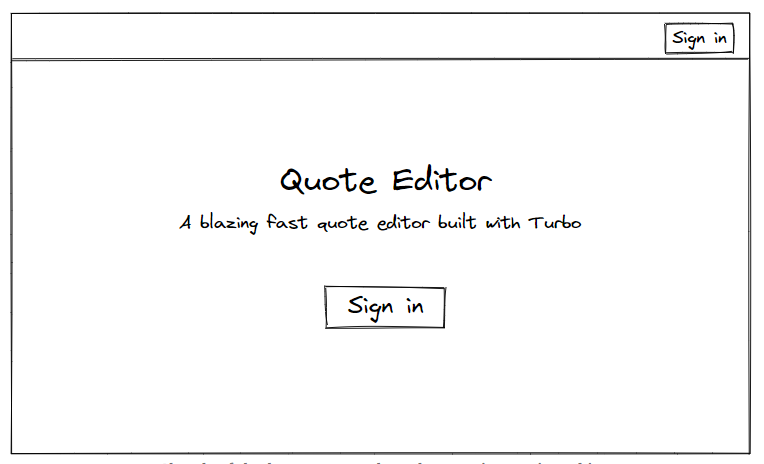
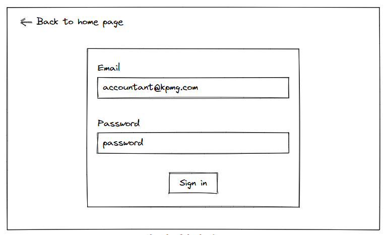
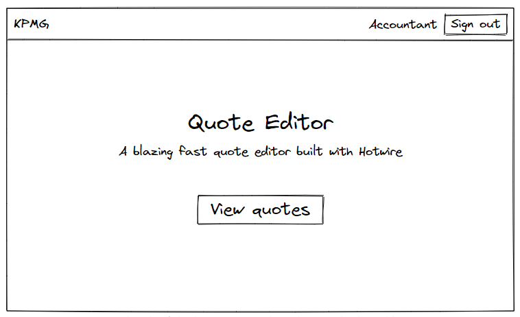
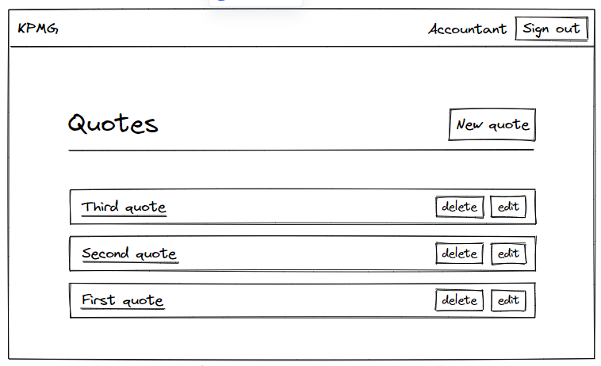
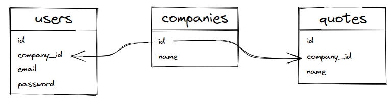

Turbo Streams and security

本章我们将学习如何安全的使用Turbo Stream 和 避免广播数据到非法的用户。

## Understanding Turbo Streams and security

在将Turbo Streams放在线上环境前，我们必须知道如何保证安全，如果把含有私密数据的HTML发送到了不该接收的人那里，这会是一个很大的问题。

让我们想象一下我们的quote编辑器被一个公司使用，公司内有很多的员工，如果有天我们的数据被一个不属于该公司的人获取到了，那这就是个很大安全事故了。

我们将使用[Devise gem](https://github.com/heartcombo/devise)对用户操作，模拟现实生活来对Turbo Stream security进行学习，并且我们将展示如果我们不够足够重视，将会出现哪些安全问题。

## What we will build

我们将画一个草图来说明本章结束时系统的样子，我们将对没有登录的用户展示登录页面链接



然后用户通过输入用户名，密码进行登录



我们的用户在登录后跳转到首页，在导航栏中我们将根据电子邮件地址显示公司名称和用户名称，当点击`View quotes`按钮时，他们便可以操作我们的编辑器



当点击`View quotes`按钮时，用户将被导航到`Quotes#index`页面，并带有一个导航栏



然后我们添加好数据后，我们的系统看起来就可以了，不过我们会在浏览器中找到一个安全问题去做实验。

`Quote,Company,User`的关系如下

- 一个用户属于一个公司
- 一个quote属于一个公司
- 一个公司有多个用户
- 一个公司有多个quote

我们的数据库设计会像下面的草图：



我们会使用`rails db:seed`指令去添加数据，来模拟一个真是的场景，在`fixtures`中，我们需要两个公司和三个用户

- **KPMG**公司有两个用户：an **accountant** and a **manager**
- **PwC**公司只有一个用户：一个绝对不该知道**KPMG公司**数据的偷听者。

让我们创建模型，并加入相关的依赖

## Adding companies to our Rails application

创建公司模型

```sh
rails generate model Company name
```

编辑迁移文件，需要保证公司名不能为空，添加：`null:false`进行数据库限制

```ruby
# db/migrate/XXXXXXXXXXXXXX_create_companies.rb

class CreateCompanies < ActiveRecord::Migration[7.0]
  def change
    create_table :companies do |t|
      t.string :name, null: false

      t.timestamps
    end
  end
end
```

执行迁移文件：

```sh
rails db:migrate
```

操作模型，加入非空验证

```ruby
# app/models/company.rb

class Company < ApplicationRecord
  validates :name, presence: true
end
```

在fixture中的companies.yml中加入上面说的数据

```yml
# test/fixtures/companies.yml

kpmg:
  name: KPMG

pwc:
  name: PwC
```

这里我们仅仅需要两个公司去让我们的实验跑通，所以就不用在`CompaniesController`中编完完整的增删改查代码和对应的试图，让我们来添加对应的用户吧。

## Adding users to our application with Devise

我们将使用[Devise gem](https://github.com/heartcombo/devise)来添加用户，并进行权限校验

先添加`Gemfile`

```
# Gemfile

gem "devise", "~> 4.8.1"
```

下载gem

```sh
bundle install
bin/rails generate devise:install
```

使用Devise生成器生成User模型

```sh
bin/rails generate devise User
bin/rails db:migrate
```

现在我们就有了User模型，我们需要页面去串联我们在介绍中描述的样子，但是这里我们不会写注册业务，这里只是为了学习安全相关内容，所以尽量让事情简单一些。

我们仅需要有用户，并能登录，所以我们将关闭Device的所有特性，除了下面两点：

- 登录
- 校验

下面的我们模型的样子

```ruby
# app/models/user.rb

class User < ApplicationRecord
  devise :database_authenticatable, :validatable
end
```

最后，在创建对应的fixtures文件

```yml
# test/fixtures/users.yml

accountant:
  email: accountant@kpmg.com
  encrypted_password: <%= Devise::Encryptor.digest(User, 'password') %>

manager:
  email: manager@kpmg.com
  encrypted_password: <%= Devise::Encryptor.digest(User, 'password') %>

eavesdropper:
  email: eavesdropper@pwc.com
  encrypted_password: <%= Devise::Encryptor.digest(User, 'password') %>
```

为了安全，Devise存储加密的密码，如果我们希望存储加密后的`password`作为密码，我们需要对应的Devise gem去进行加密，这也是为什么我们使用`Devise::Encryptor.digest`。

现在模型都已经建立好了，接下来我们就对模型建立关联关系。

---

## Users, companies and, quotes associations

目前我们的模型间还没什么关系，我们现在创建对应的移植文件来添加对应的文件

```sh
bin/rails generate migration add_company_reference_to_quotes company:references
bin/rails generate migration add_company_reference_to_users  company:references
```

第一个迁移文件，是对quotes添加`company_id`外键，第二个迁移文件，是对users添加`company_id`。

```sh
bin/rails db:migrate
```

---

**注意：**这里可能会执行失败，因为如果数据库已经有数据了，对应的`company_id`为空，这就与我们模型中设置的非空校验相冲突。

如果我们的项目已经到了线上，则只能先对所有的users和quotes指定`company_id`，然后在设置`null:false`约束，如果我们的项目不在线上，则我们可以简单的删掉数据库，然后从新创建并迁移。

```
bin/rails db:drop db:create db:migrate
```

现在我们迁移就可以完成了

---

现在我们从模型中添加对应的关联关系

```ruby
# app/models/user.rb

class User < ApplicationRecord
  devise :database_authenticatable, :validatable

  belongs_to :company
end
```

```ruby
# app/models/company.rb

class Company < ApplicationRecord
  has_many :users, dependent: :destroy
  has_many :quotes, dependent: :destroy

  validates :name, presence: true
end
```

```ruby
# app/models/quote.rb

class Quote < ApplicationRecord
  belongs_to :company

  # All the previous code
end
```

相应的，我们修改我们的fixtures数据

```yml
# test/fixtures/users.yml

accountant:
  company: kpmg
  email: accountant@kpmg.com
  encrypted_password: <%= Devise::Encryptor.digest(User, 'password') %>

manager:
  company: kpmg
  email: manager@kpmg.com
  encrypted_password: <%= Devise::Encryptor.digest(User, 'password') %>

eavesdropper:
  company: pwc
  email: eavesdropper@pwc.com
  encrypted_password: <%= Devise::Encryptor.digest(User, 'password') %>
```

```yml
# test/fixtures/quotes.yml

first:
  company: kpmg
  name: First quote

second:
  company: kpmg
  name: Second quote

third:
  company: kpmg
  name: Third quote
```

执行：`rails db:seed`来完成数据的加载

## Adding a home page to our application

现在我们已经有了用户，我们得让他们很容易地登陆，就像我们在本章节初画的草图描述一样

1. 用户必须登录后才能看到quote编辑器，并且他只能看到他所属公司的数据
2. 如果用户没有登录，则必须引导用户到首页的登录表单那里

为了解决上面的第一点，我们必须确保用户在系统的每个地方都被权限校验，让我们在`ApplicationController`中设置Devise的`authenticate_user!`方法

```ruby
# app/controllers/application_controller.rb

class ApplicationController < ActionController::Base
  before_action :authenticate_user!
end
```

解决上面的第二点，我们需要未通过权限校验的用户访问到登录表单中，否则他们无法登陆了。

```ruby
# app/controllers/application_controller.rb

class ApplicationController < ActionController::Base
  before_action :authenticate_user!, unless: :devise_controller?
end
```

我们需要一个首页去引导用户登录，所以现在创建一个`PagesController`，其中home action 作为 root path，这个Controller是公共的，所以可以跳过权限校验。

```ruby
# app/controllers/pages_controller.rb

class PagesController < ApplicationController
  skip_before_action :authenticate_user!

  def home
  end
end
```

添加对应的路由

```ruby
# config/routes.rb

Rails.application.routes.draw do
  # 这里需要加入这行代码，否则运行时会显示没有 devise的helper方法
  devise_for :users 
  
  root to: "pages#home"

  # All the other routes
end
```

添加对应的响应页面

```ruby
<%# app/views/pages/home.html.erb %>

<main class="container">
  <h1>Quote editor</h1>
  <p>A blazing fast quote editor built with Hotwire</p>

  <% if user_signed_in? %>
    <%= link_to "View quotes", quotes_path, class: "btn btn--dark" %>
  <% else %>
    <%= link_to "Sign in", new_user_session_path, class: "btn btn--dark" %>
  <% end %>
</main>
```

我们不会对这个登陆页面写过多的样式，而是花更多的时间在导航栏，让它在项目的每个页面都展示

让我们先添加导航栏的标签，现在我们会先使用占位符为公司名和当前用户名，但是很快我们就会修改掉，现在我们只需要专注于HTML

```ruby
<%# app/views/layouts/_navbar.html.erb %>

<header class="navbar">
  <% if user_signed_in? %>
    <div class="navbar__brand">
      Company name
    </div>
    <div class="navbar__name">
      Current user name
    </div>
    <%= button_to "Sign out",
                  destroy_user_session_path,
                  method: :delete,
                  class: "btn btn--dark" %>
  <% else %>
    <%= link_to "Sign in",
                new_user_session_path,
                class: "btn btn--dark navbar__right" %>
  <% end %>
</header>
```

为了让每页面都展示导航栏，所以我们可以直接在`application.html.erb`中渲染

```ruby
<%# app/views/layouts/application.html.erb %>

<!DOCTYPE html>
<html>
  <!-- All the <head> content -->

  <body>
    <%= render "layouts/navbar" %>
    <%= yield %>
  </body>
</html>
```

现在每个页面都会展示了，我们来给导航栏写一下样式

```css
// app/assets/stylesheets/components/_navbar.scss

.navbar {
  display: flex;
  align-items: center;
  box-shadow: var(--shadow-large);
  padding: var(--space-xs) var(--space-m);
  margin-bottom: var(--space-xxl);
  background-color: (var(--color-white));

  &__brand {
    font-weight: bold;
    font-size: var(--font-size-xl);
    color: var(--color-text-header);
  }

  &__name {
    font-weight: bold;
    margin-left: auto;
    margin-right: var(--space-s);
    color: var(--color-text-header);
  }

  &__right {
    margin-left: auto;
  }
}
```

记得要导入css到主文件中

```css
// app/assets/stylesheets/application.sass.scss

// All the previous imports
@import "components/navbar";
```

好了，现在除了登录表单样式没设置好，其他内容都与我们的草图大致一样，我们来在浏览器中测试一下吧。（记得执行 ： `rails db:seed`来设置好必要的数据）

---

**注意：**在执行`rails db:seed`是，我的电脑(Mac mini2 arm64)爆出错误：`is an incompatible architecture (have 'x86_64', need 'arm64')`在执行bcrypt进行加密时。

1. 查看你的`Gemfile.lock`,看是否和下面一样

```yml
PLATFORMS
  arm64-darwin-22
```

2. 如果是，则在控制台执行: `uname -m`，查看是否为：**x86_64**

这说明，你在 Rosetta 模拟器中运行 Ruby 和 gem 时，它们会认为你的系统仍然是 ARM 架构，所以执行 `bundle install` 或 `gem install` 时会生成 `arm64-darwin-22` 的 `Gemfile.lock` 中的 `PLATFORMS`。

可以看到两者出现了偏差，当我们执行`bundle install`时，将使用当前终端窗口所处的编译架构来编译 gem，而这时候我们是通过Rosetta模拟器在x86_64架构上安装的gem，所以默认使用x86_64架构编译gem，并将这些gem安装到x86_64架构目录上。所以我们会在报错信息中看到空文件的提示。

`arch -arm64 bundle install` 命令使用 `-arm64` 标志来显式指定了命令应该在 ARM64 架构下执行。这意味着它将使用 ARM64 架构编译 gem，并将这些 gem 安装到 ARM64 目录下，而不管终端窗口当前所处的架构是什么。

所以这里我们应该使用`arch -arm64 bundle install`命令以确保所有 gem 都被正确地编译和安装到 ARM64 架构目录下。这样就可以匹配上了。

---

现在让我们在页面中登陆吧，点击导航栏中的`sign in`，输入账号：accountant@kpmg.com 和 密码：password，这些都是你fixture文件中定义的假数据。

一切都正常运转，但我们应该动态的改变 公司名 和 当前用户名称

这里面我们简单的，看登录账户邮箱，从中获取当前用户名称，并在用户模型中增加方法

```ruby
# app/models/user.rb

class User < ApplicationRecord
  devise :database_authenticatable, :validatable

  belongs_to :company

  def name
    email.split("@").first.capitalize
  end
end
```

我们也应该增加一个测试去确保一切正常

```ruby
# test/models/user_test.rb

require "test_helper"

class UserTest < ActiveSupport::TestCase
  test "name" do
    assert_equal "Accountant", users(:accountant).name
  end
end
```

更新导航栏中的数据

```ruby
<%# app/views/layouts/_navbar.html.erb %>

<header class="navbar">
  <% if user_signed_in? %>
    <div class="navbar__brand">
      Company name
    </div>
    <div class="navbar__name">
      <%= current_user.name %>
    </div>
    <%= button_to "Sign out",
                  destroy_user_session_path,
                  method: :delete,
                  class: "btn btn--dark" %>
  <% else %>
    <%= link_to "Sign in",
                new_user_session_path,
                class: "btn btn--dark navbar__right" %>
  <% end %>
</header>
```

现在我们再动态的显示公司的名称，记住一个用户是属于一个公司的，所以我们需要动态的获取到`current_company`。

为了方便我们其他的View和Controller使用到`current_company`，我们将在`ApplicationController`中设置helper方法。

```ruby
# app/controllers/application_controller.rb

class ApplicationController < ActionController::Base
  before_action :authenticate_user!, unless: :devise_controller?

  private

  def current_company
    @current_company ||= current_user.company if user_signed_in?
  end
  helper_method :current_company
end
```

现在我们就可以在导航栏中使用到`current_company`了、

```ruby
<%# app/views/layouts/_navbar.html.erb %>

<header class="navbar">
  <% if user_signed_in? %>
    <div class="navbar__brand">
      <%= current_company.name %>
    </div>
    <div class="navbar__name">
      <%= current_user.name %>
    </div>
    <%= button_to "Sign out",
                  destroy_user_session_path,
                  method: :delete,
                  class: "btn btn--dark" %>
  <% else %>
    <%= link_to "Sign in",
                new_user_session_path,
                class: "btn btn--dark navbar__right" %>
  <% end %>
</header>
```

记住由于我们对模型之间加入了关联关系，并且在使用编辑器前需要用户登录，所以我们应该更新我们的测试代码，在此之后，我们将讨论 Turbo Streams and security 通过浏览器做一些实验

## Fixing our tests

现在执行：`bin/rails test:system`

第一个错误应该是 用户需要登录才能操控quotes，而在测试中登陆，我们需要依赖于`Warden gem`的helpers去避免我们手动的输入，`Devise` gem是构建与`Warden`之上的，并且`Warden::Test::Helpers`模块包含了帮助我们登陆的方法：`login_as`

为了使用它，我们先进行引入：

```ruby
# test/application_system_test_case.rb

require "test_helper"

class ApplicationSystemTestCase < ActionDispatch::SystemTestCase
  include Warden::Test::Helpers

  driven_by :selenium, using: :headless_chrome, screen_size: [1400, 1400]
end
```

现在我们就可以在继承自`ApplicationSystemTestCase`的测试类中使用`Warden::Test::Helpers`模块儿，而当我们执行每个测试之前都需要先登录，所以我们会使用`login_as`在setup block中。

```ruby
# test/system/quotes_test.rb

require "application_system_test_case"

class QuotesTest < ApplicationSystemTestCase
  setup do
    login_as users(:accountant)
    @quote = Quote.ordered.first
  end

  # All the previous code
end
```

现在再来执行一下：`rails test:system`，仍然有测试失败了，因为我们需要对quotes加入关联公司信息，让我们修改一下`QuotesController`去关联 Company model。

在`QuotesController#index`方法中应该只展示那些属于当前用户公司的quotes。

```ruby
# app/controllers/quotes_controller.rb

def index
  @quotes = current_company.quotes.ordered
end
```

当然在我们创建quote时，我们也需要确保quote关联到当前用户公司

```ruby
# app/controllers/quotes_controller.rb

def create
  # Only this first line changes to make sure the association is created
  @quote = current_company.quotes.build(quote_params)

  if @quote.save
    respond_to do |format|
      format.html { redirect_to quotes_path, notice: "Quote was successfully created." }
      format.turbo_stream
    end
  else
    render :new
  end
end
```

而对于其他的操作，我们也必须确保只能操作本公司的数据。

```ruby
class QuotesController < ApplicationController
  before_action :set_quote, only: [:show, :edit, :update, :destroy]
  # All the previous code

  private

  def set_quote
    # We must use current_company.quotes here instead of Quote
    # for security reasons
    @quote = current_company.quotes.find(params[:id])
  end

  # All the previous code
end
```

现在当我们执行测试时，都正常通过了，而执行`rails test:all`时，也都完美通过，现在我们就可以讨论 Turbo Streams and security的内容了。

## Security and Turbo Streams

让我们在浏览器中做一个实验来说明现在有什么安全问题，我们打开浏览器两个页面，最好屏幕一边一个，这样方便看到实时的更新。

- 一个页面使用正常模式
- 一个页面使用无痕私密模式

在正常模式的页面中登陆账号：`accountant@kpmg.com` 密码：password

在无痕模式的页面中登陆账号：`eavesdropper@pwc.com ` 密码：password

现在我们让两个页面都来到`Quotes#index`页面，而使用`accountant`账户，创建一个叫:`Secret quote`的quote，但我们会发现这个`Secret quote`也出现在了无痕模式中**eavesdropper**登录的页面。

这可是个大问题啊，两个账户属于不同的公司，但是却能广播查看到对方的数据。而当刷新**eavesdropper**账户时，这条数据又消失了。

这就是 Turbo Streams 的问题，所以在生产环境使用Turbo Streams前，我们应该首先了解安全性问题，下面我们来分析一下，为什么出现该问题，并该如何解决

## Turbo Stream Security in depth

安全是一个复杂的话题，但这里的解决方式很简单

我们通过浏览器的开发工具查看一下**accountant**的DOM节点和**eavesdropper**的DOM节点，在`Quotes#index`页面中我们都能看到<turbo-cable-stream-source>标签，这是我们使用`turbo_stream_from`的helper方法生成的：

```html
<%# app/views/quotes/index.html.erb %>

<%# This line generate the <turbo-cable-stream-source> tag %>
<%= turbo_stream_from "quotes" %>

<%# All previous content %>
```

我们来对比一下生成的两个标签：

```html
<!-- Accountant's session -->
<turbo-cable-stream-source
  channel="Turbo::StreamsChannel"
  signed-stream-name="InF1b3RlcyI=--eba9a5055d229db025dd2ed20d069d87c36a2e4191d8fc04971a93c851bb19fc"
>
</turbo-cable-stream-source>

<!-- Eavesdropper's session -->
<turbo-cable-stream-source
  channel="Turbo::StreamsChannel"
  signed-stream-name="InF1b3RlcyI=--eba9a5055d229db025dd2ed20d069d87c36a2e4191d8fc04971a93c851bb19fc"
>
</turbo-cable-stream-source>
```

注意两个签名是一样的，这也就是为什么所有用户收到了相同的广播数据。

---

**注意：**这里的签名是turbo_stream_from helper方法自动生成的，而不是给定的简单的参数值。来防止用户篡改其值并获取私有广播。

**注意：**你的signed_stream_name在不同项目中是不会相同的，因为签名时使用到了秘钥，而rails生成不同的秘钥为不同的项目，不过这也意味着同一个项目的秘钥是一致的，所以我们这里两个账户生成了同样的签名。

---

通过`channel`，所有用户都可以从`Turbo::StreamsChannel`中订阅，而所有的客户端与服务端的交互都经过`Turbo::StreamsChannel`

然而，所有的用户都有相同的`signed-stream-name`，在`ActionCable`中，stream的职责是路由广播到接收者那里，因此如果你有相同的签名，就会都接收到数据。

为了解决这个问题，那`signed-stream-name`参数必须有所不同。

现在我们已经明白了问题原因，让每位来看看怎么解决。

## Fixing our Turbo Streams security issue

在之前的章节，我们控制quote模型在修改，删除，新增时发送广播通知

```ruby
# app/models/quote.rb

class Quote < ApplicationRecord
  # All the previous code

  broadcasts_to ->(quote) { "quotes" }, inserts_by: :prepend
end
```

这里我们用lambda传递一个参数给`broadcasts_to`

```sh
->(quote) { "quotes" }
```

`Quotes#index`页面我们又订阅了这个流，通过下面的代码：

```ruby
<%# app/views/quotes/index.html.erb %>

<%# This line generate the <turbo-cable-stream-source> tag %>
<%= turbo_stream_from "quotes" %>

<%# All previous content %>
```

这里如果我们想要让 **accountant** 和 **eavesdropper** 拥有不同的签名，我们必须修改stream的名字，而在`turbo-rails`这很容易：

```ruby
class Quote < ApplicationRecord
  # All the previous code

  broadcasts_to ->(quote) { [quote.company, "quotes"] }, inserts_by: :prepend
end
```

这里的签名参数变成了一个数组，并且将遵循以下的规则

1. 共享广播数据的用户应该拥有lambda返回的那些拥有相同的值的数组
2. 而对于不共享广播数据的用户应该拥有不同的值的数组

用我们的例子来说，公司都为**accountant**的账户，lambda返回的数组应该是相同值的，所以他们可以共同创建，修改，删除的广播

而不同的公司的eavesdropper，就无法接受到这个广播

现在我们再来修改`Quotes#index`页面中接收的参数与匹配我们在lambda中设置的数据

```html
<%# app/views/quotes/index.html.erb %>

<%= turbo_stream_from current_company, "quotes" %>
```

我们再来在页面中测试一下，这一次，新加的数据，没有出现在**eavesdropper**的列表中。

让我们再来看一下DOM，我们会发现两个账户的签名不一样了。

```html
<!-- Accountant's session -->
<turbo-cable-stream-source
  channel="Turbo::StreamsChannel"
  signed-stream-name="IloybGtPaTh2YUc5MGQybHlaUzFqYjNWeWMyVXZRMjl0Y0dGdWVTOHhNRFU1TmpNNE5qTXc6cXVvdGVzIg==--9a371841e42663b82349431a512bdc7e22bb3b5407a57cc11d97e3d9af71247c"
>
</turbo-cable-stream-source>

<!-- Eavesdropper's session -->
<turbo-cable-stream-source
  channel="Turbo::StreamsChannel"
  signed-stream-name="IloybGtPaTh2YUc5MGQybHlaUzFqYjNWeWMyVXZRMjl0Y0dGdWVTODBNalV5TVRFeE56RTpxdW90ZXMi--7295a05abddcccdb1e26398b55722c8de8d34f7eeb6c43c0d1a28e56a2b15feb"
>
</turbo-cable-stream-source>
```

让我们再用相同公司的账户去测试，发现数据被成功的共享了。我们再来看看这次生成的DOM

```html
<!-- Accountant's session -->
<turbo-cable-stream-source
  channel="Turbo::StreamsChannel"
  signed-stream-name="IloybGtPaTh2YUc5MGQybHlaUzFqYjNWeWMyVXZRMjl0Y0dGdWVTOHhNRFU1TmpNNE5qTXc6cXVvdGVzIg==--9a371841e42663b82349431a512bdc7e22bb3b5407a57cc11d97e3d9af71247c"
>
</turbo-cable-stream-source>

<!-- Manager's session -->
<turbo-cable-stream-source
  channel="Turbo::StreamsChannel"
  signed-stream-name="IloybGtPaTh2YUc5MGQybHlaUzFqYjNWeWMyVXZRMjl0Y0dGdWVTOHhNRFU1TmpNNE5qTXc6cXVvdGVzIg==--9a371841e42663b82349431a512bdc7e22bb3b5407a57cc11d97e3d9af71247c"
>
</turbo-cable-stream-source>
```

当我们在生产环境使用Turbo Streams时，我们必须确保模型中的`broadcasts_to`和页面中的`turbo_stream_from`方法被恰当的配置，来避免安全问题。

## Wrap up

Turbo Streams是一个很棒的工具，但我如果我们不想出现安全事故，就要小心点儿使用。
