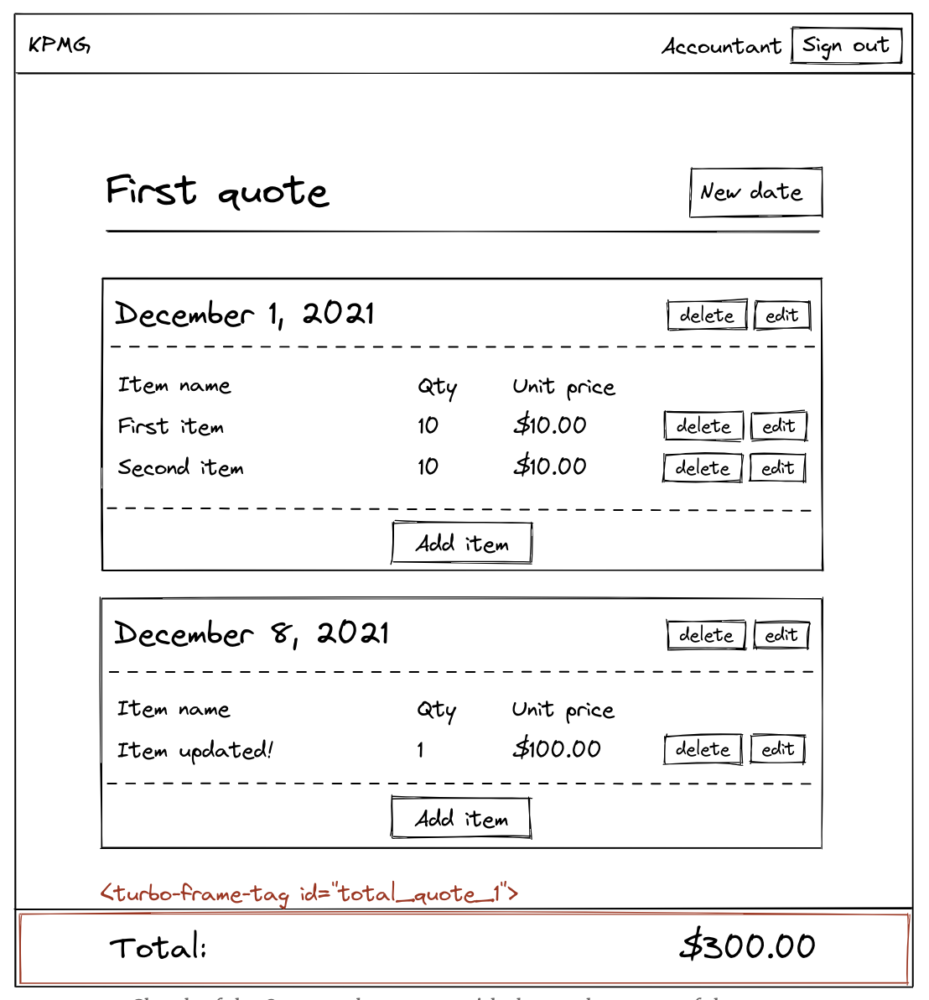

# Adding a quote total with Turbo Frames

本章节中，我们将添加一个包含quote总价格的`sticky bar`,每当我们创建，修改，删除一个line item，总价都会被更新。

## What we will build in this chapter

总价格会在下面的情况中更新：

- 一个`line item`被创建，修改，删除
- 一个`line item date`被删除，而一个line item date中可能有多个items

下面的草图，将会展示我们的quote编辑器长什么样子：



现在需求明确了，敲代码吧。

---

**Note: **现在我们已经体验过很多次Turbo Frames了，让我们来讨论一下什么时候使用`<turbo-frame> 或是 <div>`

- **当我们需要使用Turbo去拦截点击链接或者表单提交时，我们必须使用Turbo Frame**
  比如`line_items/_line_item.html.erb`局部页面的内容必须被嵌套到Turbo Frame中，因为当我们点击line item的"Edit"按钮时，我们希望Turbo能用`LineItems#edit`页面中抽离的表单替换相同id的内容时，用简单的`div`肯定就没用了。

- **当我们只是在一个Turbo Stream view中指向一段DOM的id时，我们就不需要Turbo Frame了**，比如我们在flash message时就不会使用Turbo Frame，相反我们使用含有flash id的`div`去加入新的message。我们也使用含有`quotes`id的`div`在`QUotes#index`页面，而不是Turbo Frame，因为`quotes`id只被用在Turbo Stream views中去添加quotesdao列表中，这并不需要拦截点击链接和表单提交。

我个人的偏好是始终使用 Turbo Frame 标签，因为这样更容易看出该 ID 在 Turbo Stream 视图中被使用了。这也是为什么教程中到处使用Turbo Frames，然而当你不需要Turbo Frame时，如果你不同意我的观点或者更喜欢用`div`这也完全没问题

解释了这细微的不同，让我们继续教程

---

## Designing the sticky navbar

在使用Turbo之前，我们先到`Quotes#show`页面中加上`sticky navbar`并花点儿时间设计他。

```ruby
<%# app/views/quotes/show.html.erb %>

<main class="container">
  <!-- All the previous code -->
</main>

<%= render "quotes/total", quote: @quote %>
```

在加上一个包含quote总价的局部视图标签

```ruby
<%# app/views/quotes/_total.html.erb %>

<footer class="quote-total">
  <div class="quote-total__inner container">
    <div>Total:</div>
    <div><%= number_to_currency quote.total_price %></div>
  </div>
</footer>
```

我们需要`#total_price`方法在`Quote`模型中，去展示quote的总价格

```ruby
# app/models/quote.rb

class Quote < ApplicationRecord
  # All the previous associations
  has_many :line_items, through: :line_item_dates

  # All the previous code

  def total_price
    line_items.sum(&:total_price)
  end
end
```

可以看到上面写的代码，quote的总价格是这个quote中每个line item的总价格之和，要确保在每个line item上实现了`#total_price`方法

```ruby
# app/models/line_item.rb

class LineItem < ApplicationRecord
  # All the previous code

  def total_price
    quantity * unit_price
  end
end
```

而每个line item的总价就是数量*单价，让我们很快的为刚刚实现的方法添加测试吧。

```ruby
# test/models/line_item_test.rb

require "test_helper"

class LineItemTest < ActiveSupport::TestCase
  test "#total_price returns the total price of the line item" do
    assert_equal 250, line_items(:catering_today).total_price
  end
end
```

```ruby
# test/models/quote_test.rb

require "test_helper"

class QuoteTest < ActiveSupport::TestCase
  test "#total_price returns the sum of the total price of all line items" do
    assert_equal 2500, quotes(:first).total_price
  end
end
```

再到浏览器中试试，我们应该可以在页面上看到quote的总价格，让我们再加点儿样式

```css
// app/assets/stylesheets/components/_quote_total.scss

.quote-total {
  position: fixed;
  bottom: 0;
  width: 100%;

  font-size: var(--font-size-xl);
  font-weight: bold;
  background-color: var(--color-white);
  box-shadow: var(--shadow-large);

  padding-top: var(--space-xs);
  padding-bottom: var(--space-xs);

  @include media(tabletAndUp) {
    padding-top: var(--space-m);
    padding-bottom: var(--space-m);
  }

  &__inner {
    display: flex;
    align-items: center;
    justify-content: space-between;
  }
}
```

别忘了加到manifest file

```css
// app/assets/stylesheets/application.sass.scss

@import "components/quote_total";
```

让我们在浏览器中进行测试，除了需要在我们的Quotes#show页面底部为最后一个line item date额外添加一些边距以防止与包含quote总额的sticky bar重叠之外，一切都应该按预期运行。让我们添加一个实用class以在需要时添加底部边距：

```css
// app/assets/stylesheets/utilities/_margins.scss

.mb-xxxxl {
  margin-bottom: var(--space-xxxxl);
}
```

```ruby
// app/assets/stylesheets/application.sass.scss
// All the previous code

// Utilities
@import "utilities/margins";
```

我们可以在`Quotes#show`页面加上这个class

```ruby
<%# app/views/quotes/show.html.erb %>

<main class="container mb-xxxxl">
  <!-- All the previous code -->
</main>

<%= render "quotes/total", quote: @quote %>
```

在浏览器中试试吧，quote的总价格展示没问题了，但当我们创建，更改，删除line item时，并没有被更新，而当我们删除那些有多个line items的line item date时，也有同样的问题，我们将在下一章中使用Turbo Stream views去解决这些问题。

## Updating our view with Turbo Streams

如上面提到的，我们需要去更新quote总价，当：

- 创建，修改，删除line item时
- 删除那些有多个line items的line item date时

使用Turbo Streams去更新独立页面片段是很容易的，当每次我们执行下面操作时，让我们简单的重新渲染`quotes/_total.html.erb`局部模版。

```ruby
<%# app/views/line_items/create.turbo_stream.erb %>

<%# All the previous code %>

<%= turbo_stream.update dom_id(@quote, :total) do %>
  <%= render "quotes/total", quote: @quote %>
<% end %>
```

```ruby
<%# app/views/line_items/update.turbo_stream.erb %>

<%# All the previous code %>

<%= turbo_stream.update dom_id(@quote, :total) do %>
  <%= render "quotes/total", quote: @quote %>
<% end %>
```

```ruby
<%# app/views/line_items/destroy.turbo_stream.erb %>

<%# All the previous code %>

<%= turbo_stream.update dom_id(@quote, :total) do %>
  <%= render "quotes/total", quote: @quote %>
<% end %>
```

```ruby
<%# app/views/line_item_dates/destroy.turbo_stream.erb %>

<%# All the previous code %>

<%= turbo_stream.update dom_id(@quote, :total) do %>
  <%= render "quotes/total", quote: @quote %>
<% end %>
```

也不要忘记去添加Turbo Frame tag或者一个`div`去嵌套包含总价的`sticky navbar`

```ruby
<%# app/views/quotes/show.html.erb %>

<main class="container mb-xxxxl">
  <!-- All the previous code -->
</main>

<%= turbo_frame_tag dom_id(@quote, :total) do %>
  <%= render "quotes/total", quote: @quote %>
<% end %>
```

去浏览器中试试吧

## Adding system tests to our application

别忘了加上系统测试，我们希望确保在创建，更新，删除line item时，quote的总价将被正确的更新。

```ruby
# test/system/line_items_test.rb

require "application_system_test_case"

class LineItemsTest < ApplicationSystemTestCase
  # All the previous code

  test "Creating a new line item" do
    # All the previous code
    assert_text number_to_currency(@quote.total_price)
  end

  test "Updating a line item" do
    # All the previous code
    assert_text number_to_currency(@quote.total_price)
  end

  test "Destroying a line item" do
    # All the previous code
    assert_text number_to_currency(@quote.total_price)
  end
end
```

我们也要确保当含有line items的line item date被删除后，我们的quote总价也能被正确的更新。

```ruby
# test/system/line_item_dates_test.rb

require "application_system_test_case"

class LineItemDatesTest < ApplicationSystemTestCase
  # We must include this module to be able to use the
  # `number_to_currency` method in our test
  include ActionView::Helpers::NumberHelper

  # All the previous code

  test "Destroying a line item date" do
    # All the previous code
    assert_text number_to_currency(@quote.total_price)
  end
end
```

让我们执行:`bin/rails test:all`指令时，应该都是绿色的。

## Conclusion

这就是我们Turbo Rails教程的最后一章，其源自于我们曾做的真实项目，我希望你能愉快的读完，也希望你已经学习到大量的内容关于Turbo

如果你想部署你的应用到Heroku：[YouTube demo by DHH with a timestamp to where he talks about deployment on Heroku](https://www.youtube.com/watch?v=mpWFrUwAN88&t=1755s)

如果你想了解更多关于Hotwire and Turbo，我推荐看看[hotwire-example-template](https://github.com/thoughtbot/hotwire-example-template)，仓库中所有的实例都很实用。

如果你享受这个教程，并且学习了很多内容，也可以直接在赞助[my Github profile（原作者），我将使用您的赞助维持网站，并可能在未来创建更多的教程。

欢迎与感兴趣的人分享本教程！