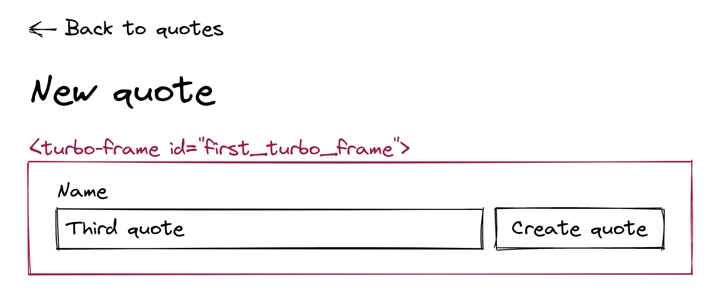

## Turbo Drive

这一章我们将解释`Turbo Drive`是什么？它是怎么转化Link clicks和Form submissions为Ajax请求来加速Rails系统。

### 是什么？

Turbo Drive是Turbo的第一部分，已经被Rails7默认引入了，可以看一下Gemfile和application.js

```
# Gemfile

# Hotwire's SPA-like page accelerator [https://turbo.hotwired.dev]
gem "turbo-rails"
```

```js
// app/javascript/application.js

// Entry point for the build script in your package.json
import "@hotwired/turbo-rails"
import "./controllers"
```

通过`Turbo Drive`，HTML页面不会被完全重新渲染，当我们的`Turbo Drive`拦截一个`link clikc or a form submission`时，这个Ajax请求的响应体只会替换HTML也页面中的<body>部分，其中大多数请求<head>部分不会修改，这就使性能得到优化，因为不需要重复下载相同的CSS和JS，当你第一次访问网页时，就下载了所有的`CSS和JS`文件，后面就不需要再加载了。

但隐藏的问题是：如果服务端CSS和JS代码更新了，但用户之前访问过网页，CSS和JS不再更新怎么办？我们将在后面回答这个问题、

### Turbo Drive是如何工作的？

Turbo Drive拦截了 links 的单击事件和 forms 的提交事件。

每次一个 link is clicked ，Turbo Drive 就会拦截该事件，重写默认的行为转为Ajax请求，并把结果中的<body>部分与原页面做替换。

这也是为什么Rails7项目默认为单页面应用，页面第一次访问不会完全从新渲染,只有<body>部分。

每当有links被click时，伪代码实现例如：

```javascript
// Select all links on the page
const links = document.querySelectorAll("a");

// Add a "click" event listener on each link to intercept the click
// and override the default behavior
links.forEach((link) => {
  link.addEventListener("click", (event) => {
    // Override default behavior
    event.preventDefault()
    // Convert the click on the link into an AJAX request
    // Replace the current page's <body> with the <body> of the response
    // and leave the <head> unchanged
  }
)});
```

对于表单提交也是类似的，不再展示伪代码。

------

在前面我们讨论过，Rails7的一大变化。

**Invalid form submissions have to return a 422 status code for Turbo Drive to replace the <body> of the page and display the form errors.**

422状态码就是指：Rails中的`:unprocessable_entity`，如果你看`scaffold generator`生成的代码，就会发现在`#create and #update`默认带有`status: :unprocessable_entity`。

------

**Turbolinks**是**Turbo Drive**的前身，只是前者只能拦截 `clicks on links`,不包含表单提交，现在**Turbo Drive**包含处理表单提交，所以作者重命名TurboLinks为Turbo Drive。

------

### 禁用Turbo Drive

在某些情况中，我们需要禁用Turbo Drive，比如某些Gem不支持Turbo Drive，一个好的应对方式就是在特定的地方禁用，例如登陆和退出的表单。下面我们示例禁用特定的`links and forms`

只需要添加：`data-turbo="false"`

比如在`Quotes#index`页面，让我们禁用新建功能中的Turbo Drive

```html
<main class="container">
  <div class="header">
    <h1>Quotes</h1>
    <%= link_to "New quote",
                new_quote_path,
                class: "btn btn--primary",
                data: { turbo: false } %>
  </div>

  <%= render @quotes %>
</main>
```

如果你去看控制台中的网络包，你会发现每次请求时有四个请求。

- One HTML request to load the Quotes#new HTML page
- One request to load the CSS bundle
- One request to load the JavaScript bundle
- One request to load the favicon of the page

------

这里是用谷歌浏览器，如果你是其他浏览器，可能不太一样

------

但如果我们恢复刚才的代码，再次请求，就会发现只有两个请求：

- One AJAX request to get the HTML for the Quotes#new page
- One request to load the favicon of the page


同样的我们也可以测试表单提交：

```html
<%= simple_form_for quote,
                    html: {
                      class: "quote form",
                      data: { turbo: false }
                    } do |f| %>

  <% if quote.errors.any? %>
    <div class="error-message">
      <%= quote.errors.full_messages.to_sentence.capitalize %>
    </div>
  <% end %>

  <%= f.input :name, input_html: { autofocus: true } %>
  <%= f.submit class: "btn btn--secondary" %>
<% end %>
```

请求时，发现有五个请求包：

- One HTML request to submit the form
- The HTML redirection to the Quotes#index page
- One request to load the CSS bundle
- One request to load the JavaScript bundle
- One request to load the favicon of the page

当我们恢复时，再看只有三个请求包

- One AJAX request to submit the form
- The AJAX redirection to the Quotes#index page
- One request to load the favicon of the page

我们已经证明了Turbo Drive为我们做什么了。

- 它转化了所有的 Link clicks 和 form submissions 为AJAX请求，并加速应用
- 它阻拦了加载CSS和JS文件的重复加载

我们发现，我们也没有写一句JS代码

------

如果你想全局禁用Turbo Drive，虽然我们不推荐，你可以以下操作：

```javascript
// app/javascript/application.js

import { Turbo } from "@hotwired/turbo-rails"
Turbo.session.drive = false
```

------

### Reloading the page with data-turbo-track="reload"

之前我们说过，ajax请求仅仅替换<body>中的内容，而没有<head>，导致用户无法使用最新的JS和CSS文件。

为了解决这个问题，每次新的请求，Turbo Drive比较DOM节点中的`data-turbo-track="reload"`和响应中的<head>，如果不同则重新加载整个页面。

如果你看一下`application.html.erb`，就会发现：

```html
<%# app/views/layouts/application.html.erb %>

<%= stylesheet_link_tag "application", "data-turbo-track": "reload" %>
<%= javascript_include_tag "application", "data-turbo-track": "reload", defer: true %>
```

现在我们知道他的作用了。

这里你可以打开控制台去看一下请求，然后修改你的CSS或JS文件，再发一个请求，看一下和之前有什么区别？

------

**注意：**做一些小的测试体验，像上面那样，会让我们更清晰的明白发生了什么事儿，在下面的章节中我们还会做一些小的测试。

------

### Changing the style of the Turbo Drive progress bar

随着`Turbo Drive`重写浏览器的默认行为，浏览器的进度条会受到一些影响。

`Turbo`已经为浏览器默认加载条构建了替代品，并且我们可以引入自己的样式，让我们先来写样式：

```css
// app/assets/stylesheets/components/_turbo_progress_bar.scss

.turbo-progress-bar {
  background: linear-gradient(to right, var(--color-primary), var(--color-primary-rotate));
}
```

别忘了引入Sass文件

```css
// app/assets/stylesheets/application.sass.scss

// All the previous code
@import "components/turbo_progress_bar";
```

想要查看到我们的样式是否成功的加载，一个好办法就是让我们程序休眠几秒，我们可以试试：

```ruby
# app/controllers/application_controller.rb

class ApplicationController < ActionController::Base
  # Add this line to see the progress bar long enough
  # and remove it when it has the expected styles
  before_action -> { sleep 3 }
end
```

现在你就能更方便的看到效果了，让我们删除这段用于休眠的临时代码吧。

### 结论

可以看到这一章很简单，我们基本没写什么自定义JS代码，就能获得实质性的性能提升。

下一章，我们将使用`Turbo Freames`去转化一些复合页面为小的片段页面。

## Turbo Frames and Turbo Stream templates

这一章节，我们将学习如何切割页面为小的独立部分，读完这一章节后，增删改查行为就会统一在index页面展示。

### 要干嘛？

在我们现在的quotes编辑器中，当进行`#new and #edit`时，会跳转到其他的页面，而本章希望通过`Turbo Frames and Turbo Streams`做到当操作时，均在`Quotes#index`页面进行。可以看看线上的效果：https://www.hotrails.dev/quotes

在我们练习`Turbo Frame`技巧前，先画一些草图来说明我们要干的事儿，然后更新我们的系统测试。

现在我们的`Quotes#index`页面长这个样子


现在我们希望当点击`New quote`时，表单可以添加到原来页面的标题下面


当我们点击`Create quote`按钮时，创建好的quote应该展示在quotes列表的最上面


当我们点击第二个quote的`Edit`按钮时，表格应该直接替换选择的这个quote卡片


当我们点击`Update quote`按钮时，又展示回卡片的样式，并且数据更新


而其他的行为，应该不受到影响

- 点击`Delete`按钮时，该条quote应该就被删除掉来了
- 点击quote的标题时，应该跳转到`Quotes#show`页面

让我们现在更新测试代码来匹配对应的设想行为

```ruby
# test/system/quotes_test.rb

require "application_system_test_case"

class QuotesTest < ApplicationSystemTestCase
  setup do
    @quote = quotes(:first)
  end

  test "Showing a quote" do
    visit quotes_path
    click_link @quote.name

    assert_selector "h1", text: @quote.name
  end

  test "Creating a new quote" do
    visit quotes_path
    assert_selector "h1", text: "Quotes"

    click_on "New quote"
    fill_in "Name", with: "Capybara quote"

    assert_selector "h1", text: "Quotes"
    click_on "Create quote"

    assert_selector "h1", text: "Quotes"
    assert_text "Capybara quote"
  end

  test "Updating a quote" do
    visit quotes_path
    assert_selector "h1", text: "Quotes"

    click_on "Edit", match: :first
    fill_in "Name", with: "Updated quote"

    assert_selector "h1", text: "Quotes"
    click_on "Update quote"

    assert_selector "h1", text: "Quotes"
    assert_text "Updated quote"
  end

  test "Destroying a quote" do
    visit quotes_path
    assert_text @quote.name

    click_on "Delete", match: :first
    assert_no_text @quote.name
  end
end
```

### 什么是Turbo Frames？

```
Turbo Frames are independent pieces of a web page that can be appended, prepended, replaced, or removed without a complete page refresh and writing a single line of JavaScript!
```

也就是可以添加，删除，替换独立的网页片段，而不需要刷新和写自定义的JS。


这一部分中，我们将使用几个小的案例来学习`Turbo Frames`，然后再实现我们上面的预想。

让我们创建第一个`Turbo Frame`，这里我们使用`turbo_frame_tag helper`，我们把`Quotes#index`页面中header部分嵌套到 id 为"first_turbo_frame"的Turbo Frame中

```html
<%# app/views/quotes/index.html.erb %>

<main class="container">
  <%= turbo_frame_tag "first_turbo_frame" do %>
    <div class="header">
      <h1>Quotes</h1>
      <%= link_to "New quote", new_quote_path, class: "btn btn--primary" %>
    </div>
  <% end %>

  <%= render @quotes %>
</main>
```

如果你看一下DOM，Turbo Frame生成的HTML就长下面的样子

```html
<turbo-frame id="first_turbo_frame">
  <div class="header">
    <h1>Quotes</h1>
    <a class="btn btn--primary" href="/quotes/new">New quote</a>
  </div>
</turbo-frame>
```

如我们看到的，`turbo_frame_tag helper`帮助我们创建了<turbo-frame>自定义标签，其中id就是我们传递给helper的第一个参数。

<turbo-frame>标签并不存在于HTML官方定义中，这是`Turbo JavaScript Library`中定义的元素。它拦截 `form submissions and clicks on links`，让这些frames成为你网页的独立部分！

现在点击`New quote`按钮，页面上被turbo-frame嵌套的部分消失了，并且浏览器控制台显示：`Response has no matching <turbo-frame id="first_turbo_frame"> element`，让我们来解释这奇怪的现象。

### Turbo Frames cheat sheet

这一部分我们将探索一些应用于`Turbo Frames`的规则

尽管我们的例子都是 Links ， 不过同样适用于 Forms

------

**规则1：**当你点击一个嵌套`Turbo Frame`的超链接，`Turbo`期待在目标页面中有一个相同ID的`frame`，然后目标页面的 `frame`内容将会替换原页面中的`frame`内容。

单纯去说，会比较难懂，我们来画一些草图，来更好的理解

现在的`Quotes#index`页面长这个样子：


现在我们用同样的ID嵌套`Quotes#new`页面片段



为了匹配草图的内容，我们现在改改代码

```html
<%# app/views/quotes/new.html.erb %>

<main class="container">
  <%= link_to sanitize("&larr; Back to quotes"), quotes_path %>

  <div class="header">
    <h1>New quote</h1>
  </div>

  <%= turbo_frame_tag "first_turbo_frame" do %>
    <%= render "form", quote: @quote %>
  <% end %>
</main>
```

现在我们在浏览器中试试，当我们刷新`Quotes#index`页面，并且点击`New quote`按钮时，你会发现`Quotes#new`页面中被嵌套的内容，替换了`Quotes#index`页面中相同id的内容。

------

**规则2：**当你点击一个嵌套了`Turbo Frame`的超链接，但目标页面没有相同ID的frame，原先页面中嵌套的frame消失，并且以日志的形式响应异常信息，显示在控制台中。

还记得我们上面遇到的奇怪现象吗？这就是因为规则二导致的，如果你在`Quotes#new`的form上，再写其他ID的frame，刷新页面，并点击`New quote`，就会看到异常日志再次出现。

------

**规则3：**link 可以指定另外一个frame id去串联内容

这个规则很有用，但需要更多的草图去理解它，我们现在使用id为second_frame的Turbo Frame去嵌套quote列表，在`Quotes#index`页面


在`Quotes#new`页面中，让我们使用相同的ID去嵌套表单


根据草图，修改我们的源码，我在代码中标记了关键部分

```html
<%# app/views/quotes/index.html.erb %>

<main class="container">
  <%= turbo_frame_tag "first_turbo_frame" do %>
    <div class="header">
      <h1>Quotes</h1>
      <%= link_to "New quote",
                  new_quote_path,
                  <% # 这里是关键，虽然被first_turbo_frame的frame嵌套 %>
                    但是指定了second_frame的frame %>
      						<% # 这里声明，将目标页面中，被id为second_frame嵌套的frame替换，当前页面中相同id的frame部分></%>
                  data: { turbo_frame: "second_frame" },
                  class: "btn btn--primary" %>
    </div>
  <% end %>

  <%= turbo_frame_tag "second_frame" do %>
    <%= render @quotes %>
  <% end %>
</main>
<%# app/views/quotes/new.html.erb %>

<main class="container">
  <%= link_to sanitize("&larr; Back to quotes"), quotes_path %>

  <div class="header">
    <h1>New quote</h1>
  </div>

  <%= turbo_frame_tag "second_frame" do %>
    <%= render "form", quote: @quote %>
  <% end %>
</main>
```

现在我们再试试，我们访问`Quotes#index`页面，刷新，点击`New quoto`按钮，可以看到我们的quotes列表被表单替换掉了。这个就是我们传递的` data: { turbo_frame: "second_frame" }`发挥的作用。

------

**注意：**

有一个特殊的frame代表整个页面，但它并不是一个真是的`Turbo Frame`，但是又很像，所以你基本可以认为是一致的。

比如：如果你想让`New quote`按钮去替换整个页面，我们可以使用`data-turbo-frame="_top"`像下面这样：


当然每个页面都默认有`_top frame`，所以`Quotes#new`也有


让我们告诉"New quote"链接去指向"_top" frame:

```html
<%# app/views/quotes/index.html.erb %>

<main class="container">
  <%= turbo_frame_tag "first_turbo_frame" do %>
    <div class="header">
      <h1>Quotes</h1>
      <%= link_to "New quote",
                  new_quote_path,
                  data: { turbo_frame: "_top" },
                  class: "btn btn--primary" %>
    </div>
  <% end %>

  <%= render @quotes %>
</main>
```

我们可以在`Quotes#new`页面中添加任意内容，因为浏览器会替换整个页面，例如：我们把`Quotes#new`页面恢复为最初的样子

```html
<%# app/views/quotes/new.html.erb %>

<main class="container">
  <%= link_to sanitize("&larr; Back to quotes"), quotes_path %>

  <div class="header">
    <h1>New quote</h1>
  </div>

  <%= render "form", quote: @quote %>
</main>
```

现在我们再访问`Quotes#indexd`页面，并进行添加，可以看到整个页面都被`Quotes#new`页面替换了，但是url没有变。

**当使用**`**_top**`**关键词时，页面的URL会改变为目标页面的URL，这与使用常规Turbo Frame时的不同之处。**

------

可以看到，Turbo Frames算是Rails开发人员的新增利器，它可以帮助我们切割独立的页面而不需要写什么JS代码。

上面的内容针对我们的项目基本够用了，但我们仍要学习两个东西：

- 怎么将`Turbo Frames`与`Turbo_stream fomat`结合使用？
- 如何对Frames命名，通过良好的约定

让我们开始练习，并通过测试，在此之前记得把`Quotes#index`页面恢复为最初状态

```html
<%# app/views/quotes/index.html.erb %>

<main class="container">
  <div class="header">
    <h1>Quotes</h1>
    <%= link_to "New quote", new_quote_path, class: "btn btn--primary" %>
  </div>

  <%= render @quotes %>
</main>
```

### Editing quotes with Turbo Frames

我们首先要实现的是当点击`Quotes#index`页面上的"Edit"按钮时，edit表单将会替换选中的quote数据。通过上面的学习，这一点很容易做到，但如何给这个Frame起一个好名字呢？

在`Quotes#index`页面中，每个被Turbo Frame嵌套的quote数据都应该有一个唯一ID，一个好的约定就是：模型单数形式_模型的ID，看我们画一个草图展示：


假如我们想编辑第二条quote，当点击第二条quote的"Edit"按钮时，我们需要`Quotes#edit`页面拥有相同的id的Turbo Frame，像下面草图一样：


通过合适的命名，当我们点击`Quotes#index`页面的edit按钮时，嵌套表单的frame将会替换嵌套第二条数据的frame。


现在开始代码实现，首先在`Quotes#index`页面，使用`quote_#{quote_id}`的frame嵌套住每条数据，而index页面的数据都来源于`_quote.html.erb`部分，所以我们只需要操作这部分：

```html
<%# app/views/quotes/_quote.html.erb %>

<%= turbo_frame_tag "quote_#{quote.id}" do %>
  <div class="quote">
    <%= link_to quote.name, quote_path(quote) %>
    <div class="quote__actions">
      <%= button_to "Delete",
                    quote_path(quote),
                    method: :delete,
                    class: "btn btn--light" %>
      <%= link_to "Edit",
                  edit_quote_path(quote),
                  class: "btn btn--light" %>
    </div>
  </div>
<% end %>
```

下来是`Quotes#edit`页面

```html
<%# app/views/quotes/edit.html.erb %>

<main class="container">
  <%= link_to sanitize("&larr; Back to quote"), quote_path(@quote) %>

  <div class="header">
    <h1>Edit quote</h1>
  </div>

  <%= turbo_frame_tag "quote_#{@quote.id}" do %>
    <%= render "form", quote: @quote %>
  <% end %>
</main>
```

通过简单的几行代码，我们就实现了功能，你可以在浏览器中去查看，测试一下提交正常数据，异常数据是否都能正常工作。

不过你可能已经注意到当我们想查看quote详情时，不再起作用，并且当删除时，控制台中会爆出异常。这和上面的规则2有关，我们很快去解决，不过在此之前，我们聊聊`dom_id helper`帮助我们写出就简洁的Turbo Frame ids。

### Turbo Frames and the dom_id helper

你可以传递一个字符串或者对象，它能帮助我们转为一个`dom_id`，比如：

```ruby
# If the quote is persisted and its id is 1:
dom_id(@quote) # => "quote_1"

# If the quote is a new record:
dom_id(Quote.new) # => "new_quote"

# Note that the dom_id can also take an optional prefix argument
# We will use this later in the tutorial
dom_id(Quote.new, "prefix") # "prefix_new_quote"
```

`turbo_frame_tag helper` 自动将对象，转为dom_id，所以我们可以改改之前在`Quotes#index`和`Quotes#edit`页面，传递对象即可，下面的代码是等价的：

```ruby
<%= turbo_frame_tag "quote_#{@quote.id}" do %>
...
<% end %>

  <%= turbo_frame_tag dom_id(@quote) do %>
...
<% end %>

  <%= turbo_frame_tag @quote %>
...
<% end %>
```

所以我们利用语法糖来改改：

```html
<%# app/views/quotes/_quote.html.erb %>

<%= turbo_frame_tag quote do %>
  <div class="quote">
    <%= link_to quote.name, quote_path(quote) %>
    <div class="quote__actions">
      <%= button_to "Delete",
                    quote_path(quote),
                    method: :delete,
                    class: "btn btn--light" %>
      <%= link_to "Edit",
                  edit_quote_path(quote),
                  class: "btn btn--light" %>
    </div>
  </div>
<% end %>
<%# app/views/quotes/edit.html.erb %>

<main class="container">
  <%= link_to sanitize("&larr; Back to quote"), quote_path(@quote) %>

  <div class="header">
    <h1>Edit quote</h1>
  </div>

  <%= turbo_frame_tag @quote do %>
    <%= render "form", quote: @quote %>
  <% end %>
</main>
```

一切工作正常，我们继续。

### Showing and deleting quotes

还是上面的问题：

1. 查看quote详情没法正常工作了，数据也消失了，控制台也报错
2. 删除按钮也在控制台报错了

现在的`Quotes#index`页面长下面的样子：


每个数据都被quote_id嵌套，但`Quotes#show`页面并没有相同的ID


这里我们就使用`"_top"`来替换整个页面

```html
<%# app/views/quotes/_quote.html.erb %>

<%= turbo_frame_tag quote do %>
  <div class="quote">
    <%= link_to quote.name,
                quote_path(quote),
                data: { turbo_frame: "_top" } %>
    <div class="quote__actions">
      <%= button_to "Delete",
                    quote_path(quote),
                    method: :delete,
                    class: "btn btn--light" %>
      <%= link_to "Edit",
                  edit_quote_path(quote),
                  class: "btn btn--light" %>
    </div>
  </div>
<% end %>
```

再在浏览器中测试，发现第一个问题就解决啦

我们也可以用同样的方式，解决第二个问题：

```html
<%# app/views/quotes/_quote.html.erb %>

<%= turbo_frame_tag quote do %>
  <div class="quote">
    <%= link_to quote.name,
                quote_path(quote),
                data: { turbo_frame: "_top" } %>
    <div class="quote__actions">
      <%= button_to "Delete",
                    quote_path(quote),
                    method: :delete,
                    form: { data: { turbo_frame: "_top" } },
                    class: "btn btn--light" %>
      <%= link_to "Edit",
                  edit_quote_path(quote),
                  class: "btn btn--light" %>
    </div>
  </div>
<% end %>
```

一切工作良好，但出现了个副作用，比如当我们给第二个数据点击Edit时，这时还没有提交，然后删除下面的数据，则页面所有内容被替换，第二条数据的修改框也就没有了。


但我们希望的是删除第三条数据时，不影响其他的数据，Turbo and Rails再次帮助了我们，让我们先删除对Delete按钮做出的修改

```html
<%# app/views/quotes/_quote.html.erb %>

<%= turbo_frame_tag quote do %>
  <div class="quote">
    <%= link_to quote.name,
                quote_path(quote),
                data: { turbo_frame: "_top" } %>
    <div class="quote__actions">
      <%= button_to "Delete",
                    quote_path(quote),
                    method: :delete,
                    class: "btn btn--light" %>
      <%= link_to "Edit",
                  edit_quote_path(quote),
                  class: "btn btn--light" %>
    </div>
  </div>
<% end %>
```

是时候介绍：`Turbo_Stream format`了

### The Turbo Stream format 

在Rails7中，表单提交会附带`Turbo_Stream format`，我们删除一个quote，并看看Rails的日志

```shell
Started DELETE "/quotes/908005781" for 127.0.0.1 at 2022-01-27 15:30:13 +0100
Processing by QuotesController#destroy as TURBO_STREAM
```

可以看到`#destroy`带有`Turbo_Stream`，让我们看看怎么利用它去解决上面的问题

在Controller中，我们需要通过`respond_to`支持HTML和`Turbo_Stream`

```ruby
# app/controllers/quotes_controller.rb

def destroy
  @quote.destroy

  respond_to do |format|
    format.html { redirect_to quotes_path, notice: "Quote was successfully destroyed." }
    format.turbo_stream
  end
end
```

我们创建对应的视图

```html
<%# app/views/quotes/destroy.turbo_stream.erb %>

<%= turbo_stream.remove "quote_#{@quote.id}" %>
```

我们在浏览器中再次删除quote，并查看响应的HTML数据：

```html
<turbo-stream action="remove" target="quote_908005780">
</turbo-stream>
```

这个就是`turbo_stream helper`接收了`remove`方法和`"quote_#{@quote.id}`，然后又转化为了<turbo-stream>自定义标签

**当浏览器接收到了这段HTML代码，Turbo知道怎么拦截它，**找到对应的参数ID，我们的例子中，就是删除掉已经被删除了的数据frame，而其他的页面不变，这正是我们想要的。

------

注意：当我写下本章内容时，`turbo_stream helper`可以帮助我们响应下面的方法：

```shell
# Remove a Turbo Frame
turbo_stream.remove

# Insert a Turbo Frame at the beginning/end of a list
turbo_stream.append
turbo_stream.prepend

# Insert a Turbo Frame before/after another Turbo Frame
turbo_stream.before
turbo_stream.after

# Replace or update the content of a Turbo Frame
turbo_stream.update
turbo_stream.replace
```

当然除了需要一个对应的方法，`turbo_stream helper`也需要一个 partial and locals 作为参数，来知道需要操作哪个HTML使用对应方法。后面我们将展开学习。

------

有了Turbo Frame 和TURBO_STREAM format的结合，我们将能够在我们的网页上执行精确的操作，而不必写一行JavaScript，因此保留我们的网页的状态。

还有就是，turbo_stream helper 也可以使用`dom_id`，因此我们再修改：

```html
<%# app/views/quotes/destroy.turbo_stream.erb %>

<%= turbo_stream.remove @quote %>
```

### Creating a new quote with Turbo Frames

也就是我们的quote编辑器新增功能，在深处实现之前，我们先画几个草图说明。

我们希望当点击New quote时，表单可以出现在页面头部的下面，当创建好后，把新加的数据放到列表的最上面，并删除原来的表单。为此我们需要多两个Turbo  Frames：

- 一个空的Turbo Frame，帮助我们接收新增表单
- 一个Turbo Frame嵌套住原来的数据集合，然后可以让新的数据放到最前面。


在`Quotes#new`页面，我们将使用`Quotes#index`页面空Turb Frame id来嵌套`Quotes#new`页面的表单


根据恰当的命名，点击"New quote"按钮时，将使用表单替换空Turbo  Frame


当提交表单时，我们将通过Turbo Streams去添加新的quote到quotes列表前面，并且再用空Frames替换`"new_quote"`frame


开始实现我们的方案：

如前面提及的，我们需要`Quotes#index view`和`Quotes#new`页面拥有两个相同id的Frames，而Frames id是`dom_id(Quotes.new)`，也就相当于`"new_quote"`

在`Quotes#new`页面，让我们把new quote表单嵌套到Turbo Frame

```html
<%# app/views/quotes/new.html.erb %>

<main class="container">
  <%= link_to sanitize("&larr; Back to quotes"), quotes_path %>

  <div class="header">
    <h1>New quote</h1>
  </div>

  <%= turbo_frame_tag @quote do %>
    <%= render "form", quote: @quote %>
  <% end %>
</main>
```

因为这里的`@quote`是一个新的记录，所以下面三个表达式是等价的：

```shell
turbo_frame_tag "new_quote"
turbo_frame_tag Quote.new
turbo_frame_tag @quote
```

现在我们给`Quotes#index`页面中加入一个空Turbo Frame使用相同的ID，为了接收 new quote form。

```html
<%# app/views/quotes/index.html.erb %>

<main class="container">
  <div class="header">
    <h1>Quotes</h1>
    <%= link_to "New quote",
                new_quote_path,
                class: "btn btn--primary",
                data: { turbo_frame: dom_id(Quote.new) } %>
  </div>

  <%= turbo_frame_tag Quote.new %>
  <%= render @quotes %>
</main>
```

可以看到我们添加了一个空的Turbo Frame，并且在"New quote"中指定：`data: { turbo_frame: dom_id(Quote.new) }`用来与连接这个空的Turbo Frame，也就是使用我们之前将的规则3。让我们写下会发生什么事儿：

1. 当我们点击`New quote`链接，点击事件会被Turbo拦截
2. Turbo知道了该请求将会与id为`new_quote`的frame进行互动，这源于我们在`New quote`链接上指定的`data-turbo-frame`
3. 该请求会以ajax形式发送，并且服务端会返回id为`new_quote`的`Quotes#new`页面
4. 当浏览器接收到了这段HTML，Turbo将会提取`Quotes#new`页面中，id为`new_quote`的frame，然后替换`Quotes#index`中相同id的frame

我们再试试提交空的数据，当点击`Create Quote`按钮时，数据是异常的，而异常信息应该出现在页面中，我们再说的细一些

1. 当我们点击`Create Quote`按钮时，表单提交将被Turbo拦截
2. 表单将被id为`new_quote`的frame嵌套
3. 服务端接收到了异常参数，并返回`Quotes#new`页面并带有异常信息
4. 浏览器接收到`status: :unprocessable_entity`的响应时，就会将新的`new_quote`的frame替换原先的，并带有异常信息

现在我们已经完成了草图上的设计，还有一件事儿就是将正常添加的数据，放在数据列表的上面。

如果你在浏览器中去试试，发现虽然数据已经创建到数据库了，但数据并没有放到数据列表的最上面。这是为啥？

当我们用一个正常数据提交表单时，`QuotesController#create`将会返回`Quotes#index`页面，其中嵌套一个id为`new_quote`的空frame，Turbo将会用这个替换我们之前的表单，但是Turbo并不知道怎么处理这个新加的数据，它应该被放到哪里？所以我们将使用Turbo Stream view来处理。

先声明`QuotesController`需要同时支持HTML和Turbo_Stream formats:

```ruby
# app/controllers/quotes_controller.rb

def create
  @quote = Quote.new(quote_params)

  if @quote.save
    respond_to do |format|
      format.html { redirect_to quotes_path, notice: "Quote was successfully created." }
      format.turbo_stream
    end
  else
    render :new, status: :unprocessable_entity
  end
end
```

然后再创建关联的视图

```ruby
<%# app/views/quotes/create.turbo_stream.erb %>

<%= turbo_stream.prepend "quotes", partial: "quotes/quote", locals: { quote: @quote } %>
<%= turbo_stream.update Quote.new, "" %>
```

在这个视图中，Turbo做了两件事儿

1. 告诉Turbo去把`app/views/quotes/_quote.html.erb`放到id为quotes的frame前面，这里可以看到我们可以直接传参关联。
2. 第二行代码告诉Turbo去更新id为`new_quote`的frame，变成空内容。

现在我们就修改`Quotes#index`页面，将quotes集合使用id为quotes的frame进行嵌套

```html
<%# app/views/quotes/index.html.erb %>

<div class="container">
  <div class="header">
    <h1>Quotes</h1>
    <%= link_to "New quote",
                new_quote_path,
                class: "btn btn--primary",
                data: { turbo_frame: dom_id(Quote.new) } %>
  </div>

  <%= turbo_frame_tag Quote.new %>

  <%= turbo_frame_tag "quotes" do %>
    <%= render @quotes %>
  <% end %>
</div>
```

现在我们再在浏览器中看看，如果你打开控制台的网络，你将看到表单提交的响应内容将会长下面的样子：

```html
<turbo-stream action="prepend" target="quotes">
  <template>
    <turbo-frame id="quote_123">
      <!-- The HTML for the quote partial -->
    <turbo-frame>
  </template>
</turbo-stream>

<turbo-stream action="update" target="new_quote">
  <template>
    <!-- An empty template! -->
  </template>
</turbo-stream>
```

我们传递的参数，可以被Turbo理解，然后Turbo执行对应的行为（append, prepend, replace, remove）在目标Fream中

------

现在我们讲讲一些技巧，关于`Turbo Stream views`中，不同的写法代表的意思是一样的。

- 这是我们之前写的

```html
<%# app/views/quotes/create.turbo_stream.erb %>

<%= turbo_stream.prepend "quotes", partial: "quotes/quote", locals: { quote: @quote } %>
<%= turbo_stream.update Quote.new, "" %>
```

- 当一行过长时，我们可以修改一下

```html
<%# app/views/quotes/create.turbo_stream.erb %>

<%= turbo_stream.prepend "quotes" do %>
  <%= render partial: "quotes/quote", locals: { quote: @quote } %>
<% end %>

<%= turbo_stream.update Quote.new, "" %>
```

- 而在Rails中下面的表述是一致的

```html
render partial: "quotes/quote", locals: { quote: @quote }
render @quote
```

- 所以我们将我们写的进行简化

```html
<%# app/views/quotes/create.turbo_stream.erb %>

<%= turbo_stream.prepend "quotes" do %>
  <%= render @quote %>
<% end %>

<%= turbo_stream.update Quote.new, "" %>
```

- 而这里的行并不长，所以不需要使用块儿语法

```html
<%# app/views/quotes/create.turbo_stream.erb %>

<%= turbo_stream.prepend "quotes", @quote %>
<%= turbo_stream.update Quote.new, "" %>
```

够优雅吧？这就是一些写`Turbo Stream views`的不同方式

### Ordering our quotes

还有一个细节问题，当我们觉得把新加的quote加入到quotes列表的最前面时，但页面刷新时，顺序又乱了，我们应该保证quotes始终按照时间进行倒序展示，最新的放在最上面，让我修改一下`Quote model`

```ruby
# app/models/quote.rb

class Quote < ApplicationRecord
  validates :name, presence: true

  scope :ordered, -> { order(id: :desc) }
end
```

然后再在`Controller#index`中使用

```ruby
# app/controllers/quotes_controller.rb

def index
  @quotes = Quote.ordered
end
```

现在即使页面刷新，顺序也是不变的。

记得修改对应的测试代码，来让测试通过

```ruby
# test/system/quotes_test.rb

setup do
  # We need to order quote as well in the system tests
  @quote = Quote.ordered.first
end
```

测试已经可以全部通过了，我们学习了很多技巧，而几乎只写了几行代码

### Adding a cancel button

现在一切工作良好，但是我们希望可以加一个`Cancel`按钮在`quotes/_form.html.erb`视图中。

```html
<%# app/views/quotes/_form.html.erb %>

<%= simple_form_for quote, html: { class: "quote form" } do |f| %>
  <% if quote.errors.any? %>
    <div class="error-message">
      <%= quote.errors.full_messages.to_sentence.capitalize %>
    </div>
  <% end %>

  <%= f.input :name, input_html: { autofocus: true } %>
  <%= link_to "Cancel", quotes_path, class: "btn btn--light" %>
  <%= f.submit class: "btn btn--secondary" %>
<% end %>
```

我们在浏览器中试试看，发现一切正常，我们看看到底发生了什么

当我们点击 **new quote form 中的Cancel链接时**

1. 这里的link是嵌套在id为`new_quote`的Frame中，所以Turbo也只会替换这部分内容
2. 这里的link导航到了`Quotes#index`页面，其中嵌套了id为`new_quote`但是是空的frame
3. Turbo就用目标页面的空frame替换掉了原来页面的form表单，所以表单消失了

当我们点击 **edit quote form 中的Cancel链接时**

1. 这里的link是嵌套在id为`dom_id(quote)`的frame中，所以也是替换这部分
2. 这里的link导航到了`Quotes#index`页面，其中嵌套了id为`dom_id(quote)`的frame，内部含有对应quote的html数据
3. 然后引用这段html替换，原先的form表单，所以表单消失了

当我们再创建quote并且同时修改多个quote时，我没法发现页面的状态是保留的，这么的各个部分是独立保留的，这就是Turbo带给我们的能力，而不需要写自定义的JS。

### Wrap up

这一章节，我们替换了原先传统的CRUD，变成一个响应式应用，而这几乎不需要什么代码，你可以试着创建，修改，删除，查看数据，感受一下我们的应用。学了很多东西，让我们休息一下，然后把所有内容理清楚。


下一章中，我们将使用`Active Cable`来给系统加入实时更新的特点。